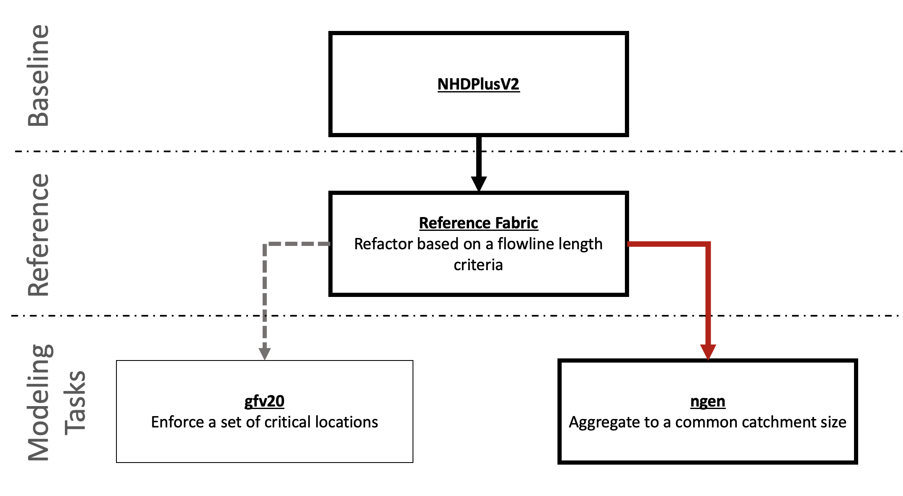
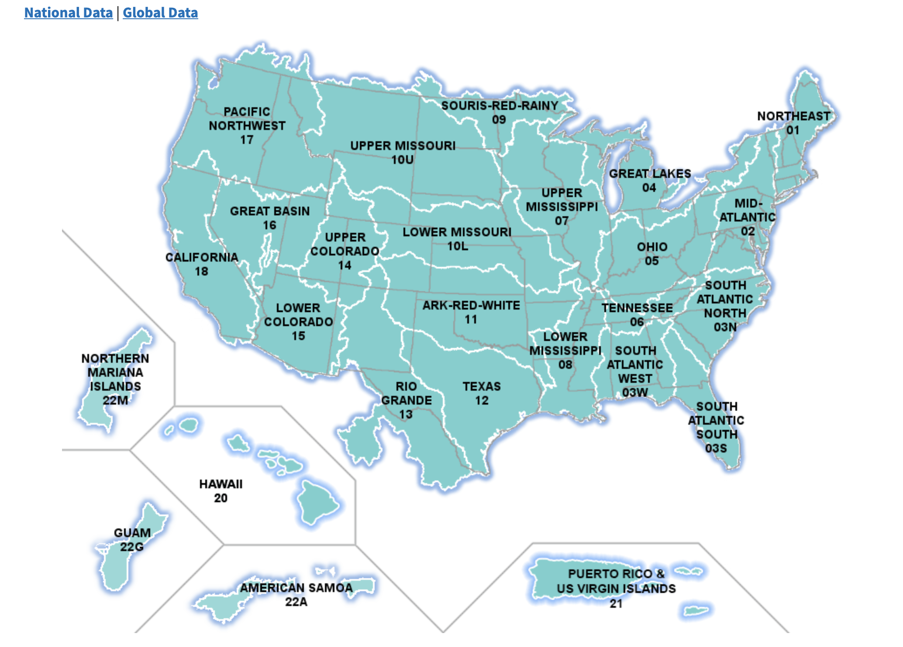
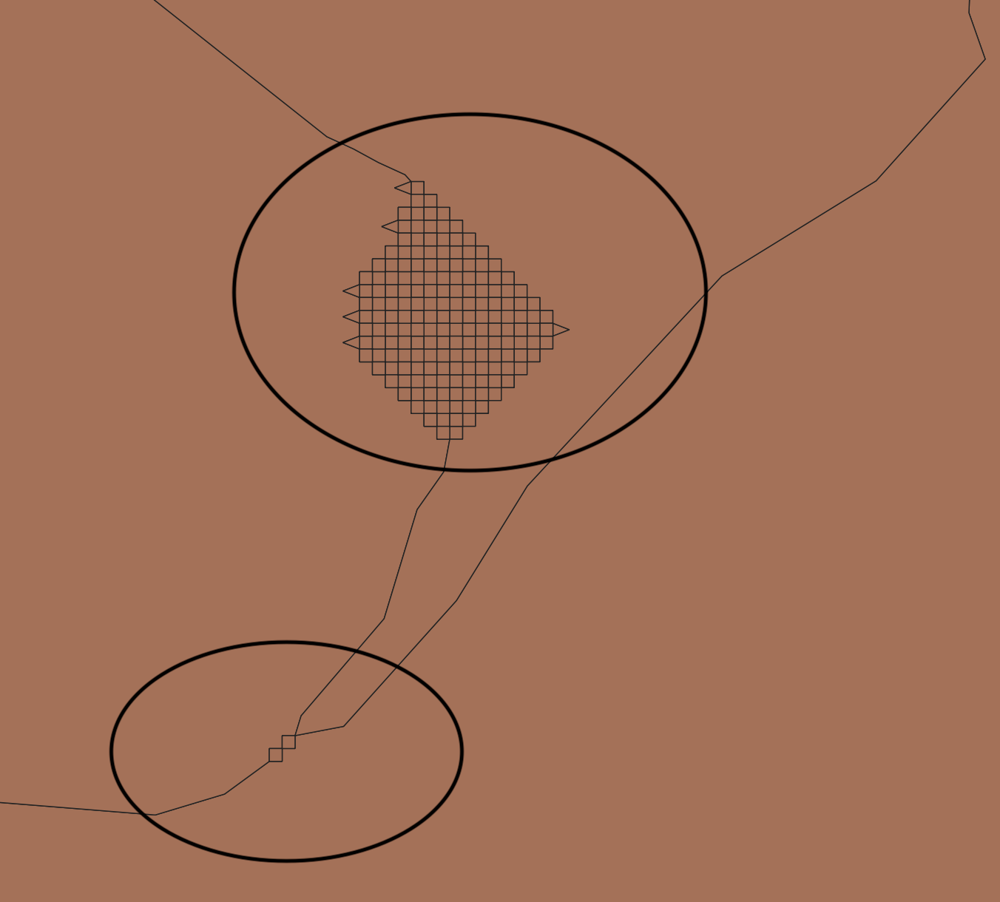
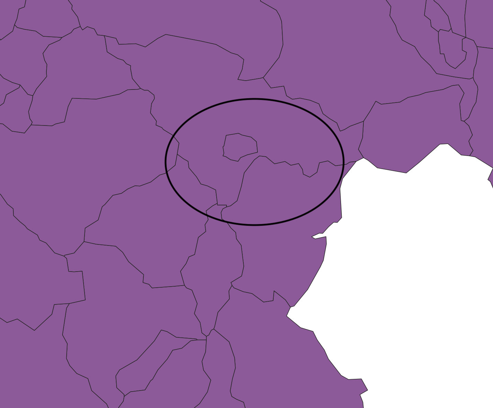
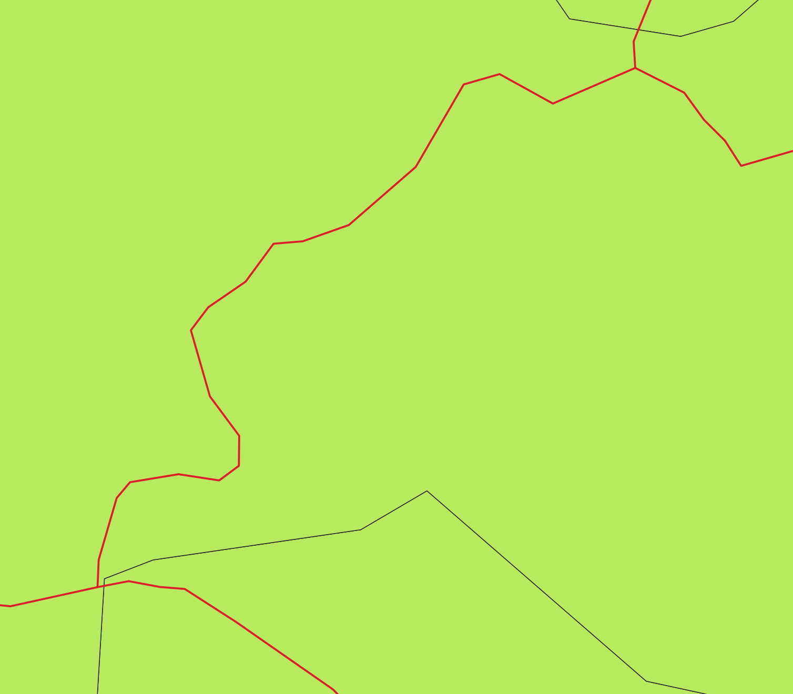

<!-- README.md is generated from README.Rmd. Please edit that file -->

```{r, include = FALSE}
knitr::opts_chunk$set(
  collapse = TRUE,
  comment = ""
)
```

# ngen hydrofabric

<!-- badges: start -->

<!-- badges: end -->

### Introduction

Per discussions with Dave B. (and others), there are three types of network refactoring needed to meet the broad needs of `ngen`, `PRMS`, `inland hydraulics`, and `FIM.`

  1. One based on a flowline length criteria (inland) 
  2. One that aims for a uniform catchment size (effective thinned network) (FIM/ngen) 
  3. A POI version that forces things down to a set critical locations (PRMS).
  
The first of these was implemented by Dave in `hyRefactor` and can serve as a basis for 2 and 3. 




The goal of this work is to contribute to the hyRefactor work where appropriate and implement a fast workflow for achiving type 2. The principle goals are to create a network with more homogeneous catchments sizes of \~10km^2, with a minimum size of 3km^2 and a maximum of 15km^2 while ensureing these values can be adjusted ad experimented with.

The first milestone for this work is focused on the Vector Processing Unit VPU 01a (NORTHEAST) of the NHDPlusV2.



### Methods

## Step 0: Run gfv20

The starting point is the refactored NHDPlusV2 produced as part of by the [gfv20 workflow]()

Running the USGS workflows produces the geopackage found in `workflow/cache/gfv20`.

## Step 1: Resolve gfv20 artifacts

This gfv20 work flow dissagregates the NHDPlus catchment/flowline network using (in part) the 30 meter Flow direction grids to separate larger catchments into smaller ones. This process results in many artifacts that are byproducts of the FDG raster cells:



A side-effect of artificially separating portions of the catchment network, these result in a MULTIPOLYGON network rather then a polygon network which allows disjoint catchments to act as a single unit unrecognized. 

The first workflow (`workflows/00_rectify_gfv20.R`) works off of the "reconciled" and "divides" layer with the goal of getting ride of these artifacts, cleaning up projection issues, removing duplicate geometries, and identifying and fixing "homeless" flowpaths (those without an associated catchment). These homeless flowlines are blended (unioned) into their downstream flowpath.

In total, there were 6,880 artifacts to clean, which could be consolidated into 5,676 individual fragments. Each fragment was then unioned into the adjoining catchment with which it shares the longest edge.

The resulting statistics of this network can be seen below.


Overall \~55% of the catchments have an area less the the desired minimum of 3km^2.

## Step 2: Aggregating along the levelpaths

To reduce the number of catchments with a area less then 3km^2, we look to aggregate catchments along each LevelPath. A levelpath is "... a unique identifier assigned to the set of flowlines that compose a stream from its headwater to its mouth". Along each level path, the Hydroseq attribute designates the order of the flowlines with the largest value occurring at the inlet and the smallest at the mouth.

In this workflow (`workflows/01_dissolve_levelpath.R`), we iterate over each level path and identify sets of catchments that can be combined to create new catchments with an area as close to, but not exceeding, 10km^2^. Once these are identified, the cathcments and flowlines are unioned and the respective characteristics summarized (ID, hydroseq, levelpath, toID, and memberCOMIDs).

Running this workflow merges ~12,000 catchments and returns the statistics seen below. Most importantly, the number of catchments < 3km^2 dropped to ~30%. 


## Step 3: Island Removal

In the raw gfv20 products one other interesting artifact is the creation of "island catchments". In total, 218 of these were identified and merged into their encompassing catchment. While this helps the overall hydrologic topology, it doesn't impact the overall network statistics.



## Step 4: First order consolidation

The vast majority of small catchments (94%) are first order catchments. In this step we look to consolidate first order catchments that either (A) have a flow path length less then 600m or (B) an area less then 3km^2. 

First, any catchment with a short flowpath is dissolved into its downstream catchment. The geometries are merged and the attributes carried accordingly.

The general rules for are aggregating catchments are a bit more complicated as many small cathcments often converge togther requiring a "master" unit to be defined. For this, all "small" catchments where identified and mapped to their downstream catchment. As a first pass any downstream catchment that appears in a small catchemnt is merged first. Then the remainging are handeled.

This work flow results in the following network statistics:


## Step 5: Island Removal round 2

Another island removal pass is made to clean up islands that were created through downstream merging. In current runs there were 13 of these...

# Represnetation

## Step 6: Topology corrections.

A major geospatial issue with the NHDplus and the resulting gfv20 output is that the intersections of the flowline network are not the same as the the catchment network. This is a major issue when we try to extract locations where water is exchanged (intersections of flowlines), as the node network would be erroneous when compared to the catchment network. 

To fix this, the flowlines are treated as the "truths" and at any any location where 2 or more flowlines come togther, the cathcmnet bounadries are massaged with a tolerance of 60m (two FDG cells). In the current runs 14,199 nodes need massaging...



## Step 7: MULTILINESTRINGS to LINESTRINGS

The ultimate aim is to be able to describe the hydrologic network as the connection between nodes through either a catchment or flowline reprensetion. Thus, we want one flowline per catchment with clear inflow and outflows that can be identified programatically. If MULTILINESTRINGS exist, there is no garuntee the identified 1st and last node are the reprective inflow and outflow points of the catchment.

437 of the ~18,000 flowpaths register as MULTILINESTIRNGS that result for either previous geometry unions or from braided/looped channels. The goal here is to reduce all multiline elments to single line elements so that all nodes on the networks are turly inflows or outflows (locations of transfer).

## Step 8: Inflow outflow Nexus Map


```{r, echo = FALSE, message=FALSE, warning=FALSE}
library(dplyr)
list(name = "ngen_cat",
features = structure(list(type = "Feature",
id = "cat-1",
inflows = list(c('nex-1', "nex-2")),
outflows = list(c("nex-3")),
properties = structure(list(type = "HY_River", totDA = 1000, 
realized_flowpath = "fp-1"), class = "data.frame", row.names = 1L)), class = "data.frame", row.names = 1L)) %>%
jsonlite::toJSON(pretty = TRUE)
```

## Waterbody Representation

The current formation of cross sections in the NWM is a trapzoid defined by a bottom width and and 


```{r, echo = FALSE, message=FALSE, warning=FALSE}
library(dplyr)
list(name = "waterbody_data",
features = structure(list(type = "Feature",
id = "wb-1",
properties = structure(list(type = "HY_River",
`cross_section` = list(data.frame("nex-id" = c("nex-1",  "nex-3"),
paramB = c(.2,.3),
paramZ= c(.5,.6))),
realized_flowpath = "wb-1", realized_catchment = "cat-1"), class = "data.frame", row.names = 1L)), class = "data.frame", row.names = 1L)) %>%
jsonlite::toJSON(pretty = TRUE)
```

## Conclusion (for now)

This process will provide a beta version of a hydrofabric that can be used for the ngen efforts. 

Currently the gfv20 takes ~5 minutes to run and the additional steps listed here and ~3-5 minutes meaning their is room for scalability and experimentation.

The release components will include:

  1. geojson files:    
    - catchments
    - flowlines
    - nexis
    
  2. Geopackage with all the above layers for easier viewing
  
  3. JSON files:
    - waterbody definitions
    - COMID cross walk
