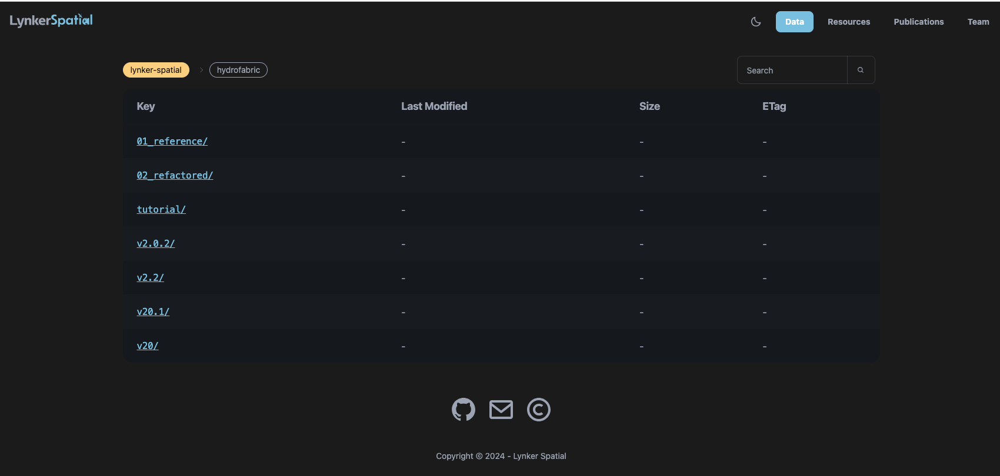
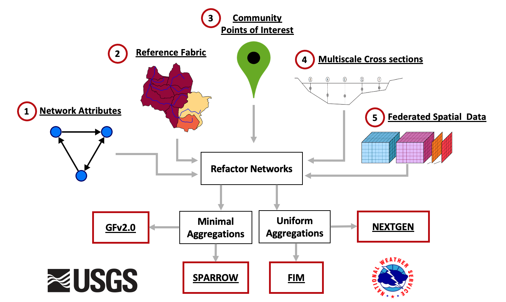

<!-- README.md is generated from README.Rmd. Please edit that file -->

```{r, include = FALSE}
options(width=100)
knitr::opts_chunk$set(
  #warning = FALSE,
  message = TRUE,
  fig.path = 'man/figures/'
)
```

## Hydrofabric

<!-- badges: start -->
[](https://github.com/NOAA-OWP/hydrofabric/actions/workflows/R-CMD-check.yaml)
[](#)
<!-- badges: end -->

This repository serves a few main purposes.


1. **Modular Hydrofabric Processes**: This package offers a collection of R packages specifically designed for hydroscience applications, akin to the tidyverse suite for hydrofabric development. It manages dependencies, resolves conflicts, and streamlines the installation process for quick setup.

2. **Hydrographic Network Utilities / Geoscience**: The repository includes tools for obtaining, manipulating, and enhancing hydrographic networks.

3. **Subsetting National Datasets**: It provides utilities to subset the national dataset for areas upstream of a specified location (XY coordinates), hydrofabric ID, indexed hydrolocation (e.g., NWIS gage, HUC12, or NID), NHDPlus COMID, or NLDI feature.

4. **Comprehensive Documentation**: The repository offers extensive documentation, including details on the hydrofabric and cross-section data model, as well as the origins and development of the product. This information can be found on the [landing page](https://noaa-owp.github.io/hydrofabric/) under [articles](https://noaa-owp.github.io/hydrofabric/articles/index.html)..

## Cloud Native Data Archives

NextGen artifacts are generated from a set of national reference datasets built in collaboration between NOAA, the USGS, and Lynker for federal water modeling efforts. These artifacts are designed to be easily updated, manipulated, and quality controlled to meet the needs of a wide range of modeling tasks while leveraging the best possible input data.

NextGen artifacts are publicly available through [lynker-spatial](https://staging.lynker-spatial.com/data?path=hydrofabric%2F) under an [ODbL](https://opendatacommons.org/licenses/odbl/summary/) license. If you use data, please ensure you (1) Attribute Lynker-Spatial, (2) Keep the data open, and that (3) any works produced from this data offer that adapted database under the ODbL. 


```{r, fig.align='center', echo = FALSE}

```

# Package Installation and Use

```{r eval = FALSE}
# install.packages("remotes")
remotes::install_github("NOAA-OWP/hydrofabric")
```

```{r}
library(hydrofabric)
```

`library(hydrofabric)` will load the core packages (alphabetical): 

* [climateR](https://github.com/mikejohnson51/climateR) for accessing federated data stores for parameter and attributes estimation
* [hfsubsetR](https://github.com/lynker-spatial/) for cloud-based hydrofabric subsetting
* [hydrofab](https://github.com/mikejohnson51/hydrofab) a tool set for "fabricating" multiscale hydrofabrics
* [ngen.hydrofab](https://github.com/mikejohnson51/ngen.hydrofab) NextGen extensions for hydrofab
* [nhdplusTools](https://github.com/doi-usgs/nhdplusTools/) for network manipulation
* [zonal](https://github.com/mikejohnson51/zonal) for catchment parameter estimation

Additionally it will load key geospatial data science libraries: 

* `dplyr` (data.frames)
* `sf` (vector)
* `terra` (raster)


# Subsetting

```{r}
# The output directory
o = "vignettes/tutorial/example.gpkg"

# Build subset
hfsubsetR::get_subset(comid = 101, outfile = o, overwrite = FALSE)
```

```{r, echo = FALSE}
{
plot(sf::read_sf(o, "divides")$geom)
plot(sf::read_sf(o, "flowpaths")$geom, col = "blue", add = TRUE)
#plot(sf::read_sf(o, "nexus")$geom, col = "red", pch = 16, add = TRUE)
}
```

We have _also_ created a CLI cloud based subsetter. Binaries of these can be installed at the [release page](https://github.com/lynker-spatial/hfsubsetCLI/releases).

> NOTE: A Python Implementation is coming soon!

# Hydrofabric Characteristic Data

A wide range of data can be appended to the hydrofabric (subsets) from resources including NOAA core modules, streamcat, hydroatlas, USGS catchment characteristics, and more. 

Preliminary documentation of these can be found [here](https://github.com/NOAA-OWP/hydrofabric/wiki/Data-Access-Patterns).

Additionally, open source tools like `climateR` and `zonal` can be used to rapidly access and summarize data for a catchment set: 

```{r}
# Read Hydrofabric
hf = read_hydrofabric(o)

# Get Daymet Data
(tmax = getDaymet(hf$catchments, varname = "tmax", startDate = "2020-10-01"))
```

```{r, echo = FALSE}
plot(tmax$tmax, main = 'Daymet Maximum Temperture')
```

```{r}
(summary_stats = zonal::execute_zonal(tmax, hf$catchments, ID = "divide_id"))
```

```{r, echo = FALSE}
plot(summary_stats['mean.tmax_2020.10.01_na_total'], main = "Aggregated Mean Temperture")
```

# Background

The NextGen artifacts are a _model application_ dataset built to meet the aims of [NextGen](https://github.com/NOAA-OWP/ngen). By design, these artifacts are derived from a set of general authoritative data products outlined in figure 1 that have been built in close collaboration with the USGS. 

```{r, fig.align='center', echo = FALSE, fig.cap="Enterprise Hydrofabric System"}

```

These include a set of base data that improves the network topology and geometry validity while defining a set of community hydrolocations (POIs). These 4 data products are used to build an intermediate refactored network from which one hydrofabric network has been aggregated to a set of community hydrolocations (minimal network), and one has been aggregated to a more consistent size (3-10 sqkm) with enforced POI locations (target distribution). NextGen specifically is derived from the target size aggregated product while the upcoming developments on the [National Hydrologic Model (NHM)](https://www.usgs.gov/mission-areas/water-resources/science/national-hydrologic-model-infrastructure) will be built from the community minimal network. 

While these two aggregations serve a wide range of federal modeling needs, our focus on open source software development and workflows allow interested parties to build there own networks starting with either the 4 reference datasets, or the refactored network!

# Resources

The hydrofabric builds on the OGC [HY_Features conceptual model](https://docs.opengeospatial.org/is/14-111r6/14-111r6.html), the [Hydrofabric Logical model](https://docs.ogc.org/per/22-040.html), and the proposed [Hydrofabric Data Model](https://noaa-owp.github.io/hydrofabric/articles/hf_dm.html). A high level introduction to these resources can be found on the [USGS Water Data blog](https://waterdata.usgs.gov/blog/hydrofabric/).

# Citation 

Please cite data and use as:

> Johnson, J. M. (2022). National Hydrologic Geospatial Fabric (hydrofabric)
for the Next Generation (NextGen) Hydrologic Modeling Framework,
HydroShare, http://www.hydroshare.org/resource/129787b468aa4d55ace7b124ed27dbde

# Questions:

<a href = "mailto:jjohnson@lynker.com?subject=NextGen Hydrofabric Questions"> Mike Johnson (Hydrofabric Lead) </a>

```{r, eval = FALSE, echo = FALSE}
#knitr::include_graphics(c("man/figures/lynker-logo.png","man/figures/noaa-logo.png", 'man/figures/usgs-logo.png'))
# library(cowplot)
# xx = ggdraw() + 
#   draw_image("man/figures/lynker-logo.png", width = 0.33, height = .25, y = .05) + 
#   draw_image("man/figures/noaa-logo.png", width = 0.33,  height = .35, x = 0.33) + 
#   draw_image("man/figures/usgs-logo.png", width = 0.33,height = .25, x = 0.66, y = .05)
# 
# cowplot::save_plot(xx, filename = "man/figures/logos.png")
``` 

```{r, fig.align='center', echo = FALSE}
knitr::include_graphics("man/figures/logos.png")
```

**Disclaimer**: These data are preliminary or provisional and are subject to revision. They are being provided to meet the need for timely best science. The data have not received final approval by the National Oceanic and Atmospheric Administration (NOAA) or the U.S. Geological Survey (USGS) and are provided on the condition that the U.S. Government shall not be held liable for any damages resulting from use of the data.

