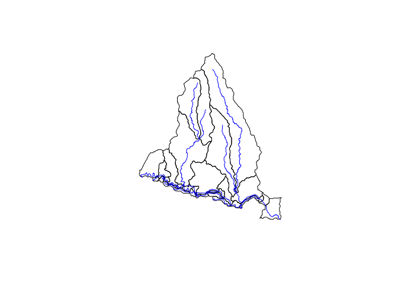
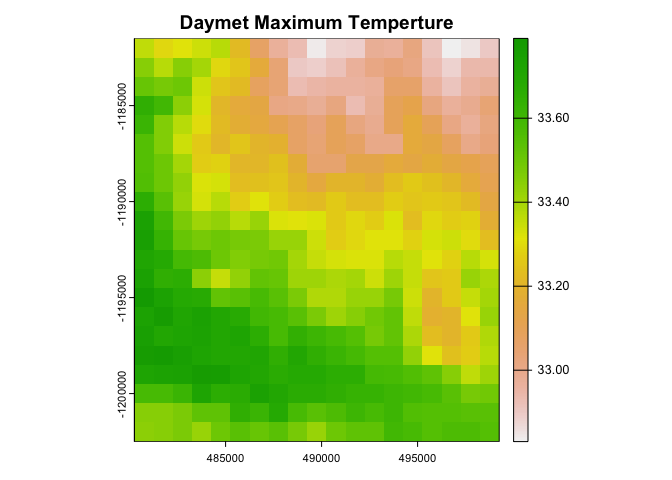
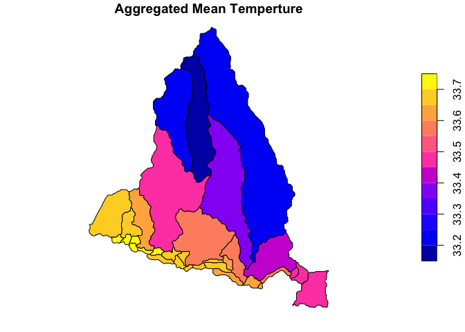

<!-- README.md is generated from README.Rmd. Please edit that file -->

## Hydrofabric for Next Generation Water Resource Modeling

<!-- badges: start -->

[](https://github.com/NOAA-OWP/hydrofabric/actions/workflows/R-CMD-check.yaml)
[](#)
<!-- badges: end -->

This development repository serves a few main purposes.

1.  Hydrofabric processes are intentionally modular. This package
    provides a collection of R package that are designed for
    hydroscience. (e.g. tidyverse for hydrofabric development)

2.  Contains utilites needed for manipulating and enhancing hydrographic
    networks.

3.  It provides the utilities to subset the national dataset for regions
    upstream of a location (XY), hydrofabric ID, indexed hydrolocation
    (e.g. NWIS gage, HUC12 or NID) or NHDPlus COMID.

4.  It provides a wide range of documentation including the hydrofabric
    and cross section data model, the origins and development of the
    product that can be found on the [landing
    page](https://noaa-owp.github.io/hydrofabric/) under
    [articles](https://noaa-owp.github.io/hydrofabric/articles/index.html).

## Cloud Native Data Archives

NextGen artifacts are generated from a set of national reference
datasets built in collaboration between NOAA, the USGS, and Lynker for
federal water modeling efforts. These artifacts are designed to be
easily updated, manipulated, and quality controlled to meet the needs of
a wide range of modeling tasks while leveraging the best possible input
data.

NextGen artifacts are publicly available through
[lynker-spatial](https://staging.lynker-spatial.com/data?path=hydrofabric%2F)
under an [ODbL](https://opendatacommons.org/licenses/odbl/summary/)
license. If you use data, please ensure you (1) Attribute
Lynker-Spatial, (2) Keep the data open, and that (3) any works produced
from this data offer that adapted database under the ODbL.


# Package Installation and Use

``` r
# install.packages("remotes")
remotes::install_github("NOAA-OWP/hydrofabric")
```

``` r
library(hydrofabric)
```

    ## ── Attaching packages ───────────────────────────────────────────────────────── hydrofabric 0.0.9 ──

    ## ✔ dplyr        1.1.4      ✔ zonal        0.0.2 
    ## ✔ climateR     0.3.5      ✔ hfsubsetR    0.0.9 
    ## ✔ nhdplusTools 1.1.0      ✔ sf           1.0.17
    ## ✔ hydrofab     0.5.1      ✔ terra        1.7.71

    ## ── Conflicts ──────────────────────────────────────────────────────────── hydrofabric_conflicts() ──
    ## ✖ terra::plot() masks climateR::plot()

    ## 
    ## Attaching package: 'hydrofabric'

    ## The following objects are masked _by_ 'package:hydrofab':
    ## 
    ##     append_style, hf_dm

`library(hydrofabric)` will load the core packages (alphabetical):

- [climateR](https://github.com/mikejohnson51/climateR) for accessing
  federated data stores for parameter and attributes estimation
- [hfsubsetR](https://github.com/lynker-spatial/) for cloud-based
  hydrofabric subsetting
- [hydrofab](https://github.com/mikejohnson51/hydrofab) a tool set for
  “fabricating” multiscale hydrofabrics
- [ngen.hydrofab](https://github.com/mikejohnson51/ngen.hydrofab)
  NextGen extensions for hydrofab
- [nhdplusTools](https://github.com/doi-usgs/nhdplusTools/) for network
  manipulation
- [zonal](https://github.com/mikejohnson51/zonal) for catchment
  parameter estimation

Additionally it will load key geospatial data science libraries:

- `dplyr` (data.frames)
- `sf` (vector)
- `terra` (raster)

# Subsetting

``` r
# The output directory
o = "vignettes/tutorial/example.gpkg"

# Build subset
hfsubsetR::get_subset(comid = 101, outfile = o, overwrite = FALSE)
```

    ## Warning in hfsubsetR::get_subset(comid = 101, outfile = o, overwrite = FALSE):
    ## vignettes/tutorial/example.gpkg already exists and overwrite is FALSE

    ## [1] "vignettes/tutorial/example.gpkg"

<!-- -->

We have *also* created a CLI cloud based subsetter. Binaries of these
can be installed at the [release
page](https://github.com/lynker-spatial/hfsubsetCLI/releases).

> NOTE: A Python Implementation is coming soon!

# Hydrofabric Characteristic Data

A wide range of data can be appended to the hydrofabric (subsets) from
resources including NOAA core modules, streamcat, hydroatlas, USGS
catchment characteristics, and more.

Preliminary documentation of these can be found
[here](https://github.com/NOAA-OWP/hydrofabric/wiki/Data-Access-Patterns).

Additionally, open source tools like `climateR` and `zonal` can be used
to rapidly access and summarize data for a catchment set:

``` r
# Read Hydrofabric
hf = read_hydrofabric(o)

# Get Daymet Data
(tmax = getDaymet(hf$catchments, varname = "tmax", startDate = "2020-10-01"))
```

    ## $tmax
    ## class       : SpatRaster 
    ## dimensions  : 21, 19, 1  (nrow, ncol, nlyr)
    ## resolution  : 1000, 1000  (x, y)
    ## extent      : 480250, 499250, -1202500, -1181500  (xmin, xmax, ymin, ymax)
    ## coord. ref. : +proj=lcc +lat_0=42.5 +lon_0=-100 +lat_1=25 +lat_2=60 +x_0=0 +y_0=0 +ellps=WGS84 +units=m +no_defs 
    ## source(s)   : memory
    ## name        : tmax_2020-10-01_na_total 
    ## min value   :                    32.83 
    ## max value   :                    33.79 
    ## unit        :                degrees C 
    ## time        : 2020-10-01 UTC

<!-- -->

``` r
(summary_stats = zonal::execute_zonal(tmax, hf$catchments, ID = "divide_id"))
```

    ## Simple feature collection with 35 features and 4 fields
    ## Geometry type: POLYGON
    ## Dimension:     XY
    ## Bounding box:  xmin: 113055 ymin: 890715 xmax: 130425 ymax: 911055
    ## Projected CRS: NAD83 / Conus Albers
    ## First 10 features:
    ##    divide_id areasqkm vpuid mean.tmax_2020.10.01_na_total                           geom
    ## 1        101   4.5666    12                      33.49731 POLYGON ((130305 890715, 13...
    ## 2    1078473  12.3156    12                      33.17984 POLYGON ((120345 900615, 12...
    ## 3    1078475  12.3408    12                      33.21740 POLYGON ((117855 903975, 11...
    ## 4    1078513   6.4449    12                      33.66863 POLYGON ((114645 895815, 11...
    ## 5    1078519   1.9197    12                      33.69756 POLYGON ((115515 895755, 11...
    ## 6    1078525   0.3789    12                      33.70147 POLYGON ((115965 895215, 11...
    ## 7    1078527   0.3312    12                      33.72665 POLYGON ((114735 895485, 11...
    ## 8    1078535   0.3582    12                      33.70396 POLYGON ((116445 895155, 11...
    ## 9    1078545   0.2862    12                      33.70000 POLYGON ((116445 894735, 11...
    ## 10   1078549   4.6296    12                      33.60812 POLYGON ((117675 894825, 11...

<!-- -->

# Background

The NextGen artifacts are a *model application* dataset built to meet
the aims of [NextGen](https://github.com/NOAA-OWP/ngen). By design,
these artifacts are derived from a set of general authoritative data
products outlined in figure 1 that have been built in close
collaboration with the USGS.

<div class="figure" style="text-align: center">


<p class="caption">
Enterprise Hydrofabric System
</p>

</div>

These include a set of base data that improves the network topology and
geometry validity while defining a set of community hydrolocations
(POIs). These 4 data products are used to build an intermediate
refactored network from which one hydrofabric network has been
aggregated to a set of community hydrolocations (minimal network), and
one has been aggregated to a more consistent size (3-10 sqkm) with
enforced POI locations (target distribution). NextGen specifically is
derived from the target size aggregated product while the upcoming
developments on the [National Hydrologic Model
(NHM)](https://www.usgs.gov/mission-areas/water-resources/science/national-hydrologic-model-infrastructure)
will be built from the community minimal network.

While these two aggregations serve a wide range of federal modeling
needs, our focus on open source software development and workflows allow
interested parties to build there own networks starting with either the
4 reference datasets, or the refactored network!

# Resources

The hydrofabric builds on the OGC [HY_Features conceptual
model](https://docs.opengeospatial.org/is/14-111r6/14-111r6.html), the
[Hydrofabric Logical model](https://docs.ogc.org/per/22-040.html), and
the proposed [Hydrofabric Data
Model](https://noaa-owp.github.io/hydrofabric/articles/hf_dm.html). A
high level introduction to these resources can be found on the [USGS
Water Data blog](https://waterdata.usgs.gov/blog/hydrofabric/).

# Citation

Please cite data and use as:

> Johnson, J. M. (2022). National Hydrologic Geospatial Fabric
> (hydrofabric) for the Next Generation (NextGen) Hydrologic Modeling
> Framework, HydroShare,
> <http://www.hydroshare.org/resource/129787b468aa4d55ace7b124ed27dbde>

# Questions:

<a href = "mailto:jjohnson@lynker.com?subject=NextGen Hydrofabric Questions">
Mike Johnson (Hydrofabric Lead) </a>


**Disclaimer**: These data are preliminary or provisional and are
subject to revision. They are being provided to meet the need for timely
best science. The data have not received final approval by the National
Oceanic and Atmospheric Administration (NOAA) or the U.S. Geological
Survey (USGS) and are provided on the condition that the U.S. Government
shall not be held liable for any damages resulting from use of the data.
