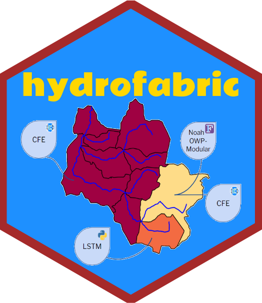
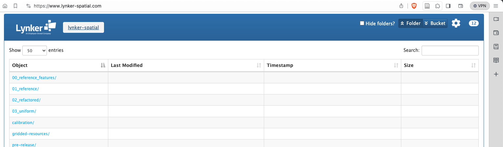
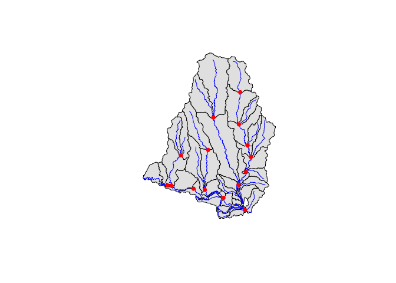
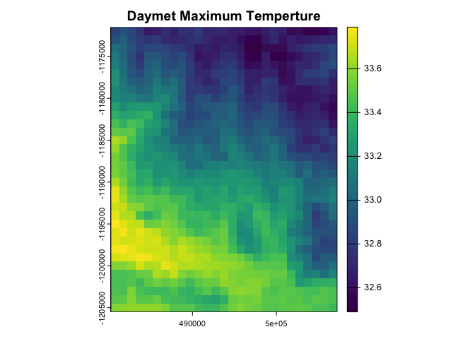
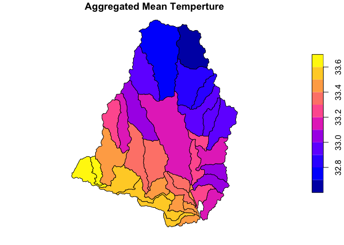

<!-- README.md is generated from README.Rmd. Please edit that file -->

# Hydrofabric:<a href="https://github.com/NOAA-OWP/hydrofabric"></a>

<!-- badges: start -->

[](https://github.com/NOAA-OWP/hydrofabric/actions/workflows/R-CMD-check.yaml)
[](#)
<!-- badges: end -->

This repository serves a few main purposes.

1.  **Modular Hydrofabric Processes**: This package offers a collection
    of R packages specifically designed for hydroscience applications,
    akin to the tidyverse suite for hydrofabric development. It manages
    dependencies, resolves conflicts, and streamlines the installation
    process for quick setup.

2.  **Hydrographic Network Utilities / Geoscience**: The repository
    includes tools for obtaining, manipulating, and enhancing
    hydrographic networks.

3.  **Subsetting National Datasets**: It provides utilities to subset
    the national dataset for areas upstream of a specified location (XY
    coordinates), hydrofabric ID, indexed hydrolocation (e.g., NWIS
    gage, HUC12, or NID), NHDPlus COMID, or NLDI feature.

4.  **Comprehensive Documentation**: The repository offers extensive
    documentation, including details on the hydrofabric and
    cross-section data model, as well as the origins and development of
    the product. This information can be found on the [landing
    page](https://noaa-owp.github.io/hydrofabric/) under
    [articles](https://noaa-owp.github.io/hydrofabric/articles/index.html)..

## Cloud Native Data Archives

NextGen artifacts are generated from a set of national reference
datasets built in collaboration between NOAA, the USGS, and Lynker for
federal water modeling efforts. These artifacts are designed to be
easily updated, manipulated, and quality controlled to meet the needs of
a wide range of modeling tasks while leveraging the best possible input
data.

NextGen artifacts are publicly available through
[lynker-spatial](https://staging.lynker-spatial.com/data?path=hydrofabric%2F)
under an [ODbL](https://opendatacommons.org/licenses/odbl/summary/)
license. If you use data, please ensure you (1) Attribute
Lynker-Spatial, (2) Keep the data open, and that (3) any works produced
from this data offer that adapted database under the ODbL.



# Package Installation and Use

``` r
# install.packages("remotes")
remotes::install_github("NOAA-OWP/hydrofabric")
```

``` r
library(hydrofabric)
```

    ## ── Attaching packages ───────────────────────────────────────────────────────── hydrofabric 0.2.1 ──

    ## ✔ climateR  0.3.7      ✔ hydroloom 1.1.0 
    ## ✔ dplyr     1.1.4      ✔ sf        1.0.19
    ## ✔ hfsubsetR 0.3.2      ✔ terra     1.7.78
    ## ✔ hydrofab  0.6        ✔ zonal     0.1.0

    ## ── Conflicts ──────────────────────────────────────────────────────────── hydrofabric_conflicts() ──
    ## ✖ terra::plot()  masks climateR::plot()
    ## ✖ terra::query() masks hfsubsetR::query()

    ## 
    ## Attaching package: 'hydrofabric'

    ## The following objects are masked _by_ 'package:hydrofab':
    ## 
    ##     append_style, hf_dm

`library(hydrofabric)` will load the core packages (alphabetical):

- [climateR](https://github.com/mikejohnson51/climateR) for accessing
  federated data for parameter and attributes estimation
- [hfsubsetR](https://github.com/lynker-spatial/) for cloud-based
  hydrofabric subsetting
- [hydrofab](https://github.com/mikejohnson51/hydrofab) a tool set for
  “fabricating” multiscale hydrofabrics
- [hydroloom](https://github.com/doi-usgs/nhdplusTools/) for network
  manipulation
- [zonal](https://github.com/mikejohnson51/zonal) for spatial grid to
  polygon summaries

Additionally it will load key geospatial data science libraries:

- `dplyr` (data.frames)
- `sf` (vector geodata)
- `terra` (raster geodata)

# Subsetting

``` r
gpkg <- './conus_nextgen.gpkg'

get_hydrofabric(outfile = gpkg)
```

``` r
subset_fabric <- get_subset(gpkg = gpkg, 
                            comid = 101)
```

<!-- -->

We have *also* created a CLI cloud based subsetter. Binaries of these
can be installed at the [release
page](https://github.com/lynker-spatial/hfsubsetCLI/releases).

# Hydrofabric Characteristic Data

A wide range of data can be appended to the hydrofabric (subsets) from
resources including NOAA core modules, streamcat, hydroatlas, USGS
catchment characteristics, and more.

Preliminary documentation of these can be found
[here](https://github.com/NOAA-OWP/hydrofabric/wiki/Data-Access-Patterns).

Additionally, open source tools like `climateR` and `zonal` can be used
to rapidly access and summarize data for a catchment set:

``` r
# Get Daymet Data
(tmax = getDaymet(subset_fabric$catchments, 
                  varname = "tmax", 
                  startDate = "2020-10-01"))
```

    ## $tmax
    ## class       : SpatRaster 
    ## dimensions  : 34, 27, 1  (nrow, ncol, nlyr)
    ## resolution  : 1000, 1000  (x, y)
    ## extent      : 480250, 507250, -1205500, -1171500  (xmin, xmax, ymin, ymax)
    ## coord. ref. : +proj=lcc +lat_0=42.5 +lon_0=-100 +lat_1=25 +lat_2=60 +x_0=0 +y_0=0 +ellps=WGS84 +units=m +no_defs 
    ## source(s)   : memory
    ## name        : tmax_2020-10-01_na_total 
    ## min value   :                    32.49 
    ## max value   :                    33.79 
    ## unit        :                degrees C 
    ## time        : 2020-10-01 UTC

<!-- -->

``` r
(summary_stats = zonal::execute_zonal(tmax, 
                                      subset_fabric$catchments, 
                                      ID = "divide_id"))
```

    ## Simple feature collection with 33 features and 11 fields
    ## Geometry type: POLYGON
    ## Dimension:     XY
    ## Bounding box:  xmin: 113055 ymin: 888405 xmax: 138555 ymax: 920325
    ## Projected CRS: NAD83 / Conus Albers
    ## First 10 features:
    ##      divide_id        toid    type ds_id  areasqkm vpuid         id  lengthkm tot_drainage_areasqkm
    ## 1  cat-2440455 nex-2440456 network    NA 12.333600    12 wb-2440455  8.311509              12.33360
    ## 2  cat-2440456 nex-2440457 network    NA 22.042350    12 wb-2440456  8.331279              46.69020
    ## 3  cat-2440457 nex-2440458 network    NA 14.172300    12 wb-2440457  6.178294              75.85065
    ## 4  cat-2440458 nex-2440459 network    NA  8.410501    12 wb-2440458  8.247455             152.46045
    ## 5  cat-2440459 nex-2440460 network    NA  8.895599    12 wb-2440459  8.716688             174.68595
    ## 6  cat-2440463 nex-2440460 network    NA  7.793550    12 wb-2440463  5.555428               7.79355
    ## 7  cat-2440464 nex-2440465 network    NA 49.057200    12 wb-2440464 13.680996              49.05720
    ## 8  cat-2440465 nex-2440466 network    NA 58.074299    12 wb-2440465 18.292739             129.15360
    ## 9  cat-2440466 nex-2440460 network    NA  3.231900    12 wb-2440466  6.033382             290.13525
    ## 10 cat-2440467 nex-2440460 network    NA  6.275700    12 wb-2440467  3.406335               6.27570
    ##    has_flowline mean.tmax_2020.10.01_na_total                           geom
    ## 1          TRUE                      33.21733 POLYGON ((117855 903975, 11...
    ## 2          TRUE                      33.48803 POLYGON ((118485 894765, 11...
    ## 3          TRUE                      33.58906 POLYGON ((119205 893865, 11...
    ## 4          TRUE                      33.59082 POLYGON ((125595 892305, 12...
    ## 5          TRUE                      33.49315 POLYGON ((132465 889485, 13...
    ## 6          TRUE                      33.18192 POLYGON ((133125 892065, 13...
    ## 7          TRUE                      32.79919 POLYGON ((126585 907905, 12...
    ## 8          TRUE                      33.19112 POLYGON ((131505 895095, 13...
    ## 9          TRUE                      33.47892 POLYGON ((132015 891435, 13...
    ## 10         TRUE                      33.28711 POLYGON ((132045 891555, 13...

<!-- -->

# Background

The NextGen artifacts are a *model application* dataset built to meet
the aims of [NextGen](https://github.com/NOAA-OWP/ngen). By design,
these artifacts are derived from a set of general authoritative data
products outlined in figure 1 that have been built in close
collaboration with the USGS.

<div class="figure" style="text-align: center">


<p class="caption">
Enterprise Hydrofabric System
</p>

</div>

These include a set of base data that improves the network topology and
geometry validity while defining a set of community hydrolocations
(POIs). These 4 data products are used to build an intermediate
refactored network from which one hydrofabric network has been
aggregated to a set of community hydrolocations (minimal network), and
one has been aggregated to a more consistent size (3-10 sqkm) with
enforced POI locations (target distribution). NextGen specifically is
derived from the target size aggregated product while the upcoming
developments on the [National Hydrologic Model
(NHM)](https://www.usgs.gov/mission-areas/water-resources/science/national-hydrologic-model-infrastructure)
will be built from the community minimal network.

While these two aggregations serve a wide range of federal modeling
needs, our focus on open source software development and workflows allow
interested parties to build there own networks starting with either the
4 reference datasets, or the refactored network!

# Resources

The hydrofabric builds on the OGC [HY_Features conceptual
model](https://docs.opengeospatial.org/is/14-111r6/14-111r6.html), the
[Hydrofabric Logical model](https://docs.ogc.org/per/22-040.html), and
the proposed [Hydrofabric Data
Model](https://noaa-owp.github.io/hydrofabric/articles/hf_dm.html). A
high level introduction to these resources can be found on the [USGS
Water Data blog](https://waterdata.usgs.gov/blog/hydrofabric/).

# Citation

Please cite data and use as:

> Johnson, J. M. (2022). National Hydrologic Geospatial Fabric
> (hydrofabric) for the Next Generation (NextGen) Hydrologic Modeling
> Framework, HydroShare,
> <http://www.hydroshare.org/resource/129787b468aa4d55ace7b124ed27dbde>

# Questions:

<a href = "mailto:mike.johnson@noaa.gov?subject=NextGen Hydrofabric Questions">
Mike Johnson (Hydrofabric Program Lead) </a>


**Disclaimer**: These data are preliminary or provisional and are
subject to revision. They are being provided to meet the need for timely
best science. The data have not received final approval by the National
Oceanic and Atmospheric Administration (NOAA) or the U.S. Geological
Survey (USGS) and are provided on the condition that the U.S. Government
shall not be held liable for any damages resulting from use of the data.
