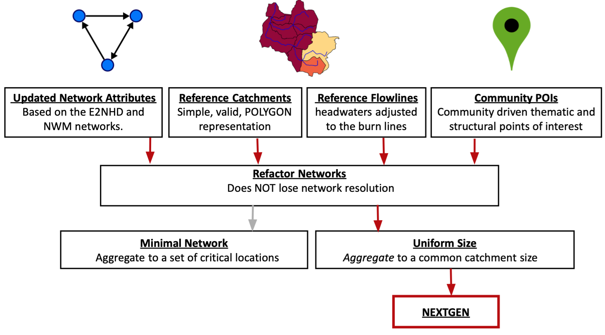

<style type="text/css">

 .title{
    display: none;
  }
  
.main-container {
  max-width: 1800px !important;
  padding-left: 250px;
  padding-right: 250px;
  margin-left: 0;
  margin-top: 0;
  margin-right: auto;
}

.blackbox {
  padding: 20px;
  background: gray90;
  color: black;
  border: 4px solid black;
  border-radius: 10px;
  margin-top: 30px;
  margin-bottom: 30px;
  margin-left: 0;
  margin-right: auto;
}
</style>

```{r, echo = F, message = FALSE, warning=FALSE}
library(dplyr)
library(leaflet)
```

```{r, echo = FALSE, message = FALSE, warning=FALSE}

current_version = 'v1.0'

meta = data.frame(path = list.files('/Volumes/Transcend/ngen/CONUS-hydrofabric/nextgen',full.name = TRUE, pattern = "gpkg$")) %>% 
  mutate(file = basename(path),
         v = gsub(".gpkg", "", gsub("nextgen_", "", file)),
         gpkg_link = glue::glue('https://nextgen-hydrofabric.s3.amazonaws.com/{current_version}/nextgen_{v}.gpkg'),
         vpu = paste0("<a href='",gpkg_link,"'>",v,"</a>")) 

vpus = nhdplusTools::get_boundaries() %>%
  filter(VPUID %in% meta$v) %>% 
  sf::st_transform('+proj=longlat +datum=WGS84')
                  
for(i in 1:nrow(meta)){
  t = sf::st_layers(meta$path[i])
  meta$flowpaths[i] =  prettyNum(t$features[which(t$name == "flowpaths")],big.mark=",",scientific=FALSE)
  meta$divides[i] =  prettyNum(t$features[which(t$name == "divides")],big.mark=",",scientific=FALSE)
  meta$nexus[i] =  prettyNum(t$features[which(t$name == "nexus")],big.mark=",",scientific=FALSE)
  meta$size[i] = paste0(round(file.size(meta$path[i]) / 1e6, 2), " Mb")
}

labels = paste("VPU", vpus$VPUID)

pop <- paste(
      paste0('<strong>GPKG: </strong>', meta$vpu ),
      paste("<strong>Flowpath:</strong>", meta$flowpaths),
      paste("<strong>Divides:</strong>", meta$divides),
      paste("<strong>Size:</strong>", meta$size),
      sep = "<br/>"
    )

bbox = as.numeric(sf::st_bbox(vpus))

```


<center>
# NOAA OWP Next Generation Modeling Framework Hydrofabric
</center>
<br>
<br>

## What is it?

Next Generation Modeling Framework (NextGen) hydrofabric artifacts are distributed by _NHDPlusV2_ **V**ector **P**rocessing **U**nits. They are generated from a set of national reference datasets built in collaboration between the USGS and NOAA for federal water modeling efforts. These artifacts are designed to be easily updated, manipulated, and quality controlled to meet the needs of a wide range of modeling tasks while leveraging the best possible input data.

## How do I get it?

NextGen artifacts are publicly available through a partnership with Lynker and the NOAA OWP. For each VPU two artifacts are available:
 
  - a geopackage that contains all tables, spatial data, and lookups relvant to a hydrofabric logical model
  - a zip folder containing the files needed to run the [Next Generation (NextGen) Water Modelling Framework](https://github.com/NOAA-OWP/ngen).

These can be programatically accessed using the respective URL patterns:

### s3

```r
s3://nextgen-hydrofabric/{version}/nextgen_{VPU}.gpkg
s3://nextgen-hydrofabric/{version}/nextgen_{VPU}.zip
```

### https
```r
https://nextgen-hydrofabric.s3.amazonaws.com/{version}/nextgen_{VPU}.gpkg
https://nextgen-hydrofabric.s3.amazonaws.com/{version}/nextgen_{VPU}.zip
```

Right now only version `v1.0` is available!

## Interactive Viewer

<center>

```{r, echo = FALSE}
#pal <- colorNumeric("BuPu", domain  = AOI$count, n = 10)
  
leaflet(width='100%') %>% 
  addProviderTiles(providers$CartoDB.Positron) %>% 
  addPolygons(data = vpus, 
              fillColor  = "gray", 
              color = "navy",
              fillOpacity = .3,
              weight = 1, 
              label = labels,
              popup = pop,
              highlightOptions = highlightOptions(color = "#FEBC11", weight = 5, bringToFront = FALSE, opacity = 1)) %>% 
  setMaxBounds(lng1 = bbox[1], lng2 = bbox[3], lat1 = bbox[2], lat2 = bbox[4])


```

```{r, echo = FALSE}
library(DT)

getTotal <- function(index, data){

  if(index < 1 || index > ncol(data)){
    return("")
  }  
  
  col <- data[,index]
  col <- gsub("[Mb]","",col)
  col <- suppressWarnings(as.numeric(gsub(",", "", col)))
  if(all(is.na(col))){
    return("Totals")
  } else {
    return(prettyNum(sum(col), big.mark=",",scientific=FALSE))
  }
}

m = meta %>% 
  select(-file, -path, -gpkg_link, -v) 


m = rbind(m, sapply(1:ncol(m), function(x){ getTotal(x, m) }))

  DT::datatable(m, escape = FALSE, width="100%",  filter = "none", 
                  rownames = T,
                options = list(autoWidth = T, 
                              pageLength = 25, 
                              scrollCollapse = T,
                              dom = 'lftp',
                              columnDefs = list(list(visible = F, targets = 0)))) %>% 
  formatStyle(0, target = "row", fontWeight = styleEqual(dim(m)[1], "bold"))

  

```
</center>

:::{ .main-container}

# Gridded Resources

The following resources are made available as VRTs

- `DEM`: Digital elevation Model (cm)
- `hydroDEM`: Hydro Conditioned DEM
- `TWI`: Topographic Wetness Index 

# A resource built on collaboration

The NextGen artifacts are a _model application_ dataset built to meet the aims of NextGen. By design, these artifacts are derived from a set of general authorative data products outlined in figure 1 that have been built in close collaboration with colleagues at the USGS (Dave Blodgett and Andy Bock). 

```{r, fig.align='center', echo = FALSE, fig.cap="Figure 1"}

```

These include a set of base data that improves the network topology and geometry validity while defining a set of community points of interest (POI).  These 4 data products are used to build an intermediate refactored network from which one hydrofabric network has been aggregated to a set of community POIs (minimal network), and one has been aggregated to a more consistent size (3-10 sqkm) with enforced POI locations (uniform). NextGen specifically is derived from the uniform size aggregated product while the upcoming developments on the [National Hydrologic Model (NHM)](https://www.usgs.gov/mission-areas/water-resources/science/national-hydrologic-model-infrastructure) will be built from the community minimal network. While these two aggregations serve a wide range of federal modeling needs, our focus on open source software development and workflows  allow interested parties to build there own networks starting with either the 4 reference datasets, or the refactored network!

The reference, refactor, minimal, and uniform hydrofabrics can all be accessed [here](https://www.sciencebase.gov/catalog/item/60be0e53d34e86b93891012b).


<br>
<br>


::: {#hello .blackbox .left}
**Disclaimer**: These data are preliminary or provisional and are subject to revision. They are being provided to meet the need for timely best science. The data have not received final approval by the National Oceanic and Atmospheric Administration (NOAA) or the U.S. Geological Survey (USGS) and are provided on the condition that neither NOAA, the USGS, nor the U.S. Government shall be held liable for any damages resulting from the authorized or unauthorized use of the data.
:::


:::

<br>
<br>
<br>
<br>
<br>
<br>