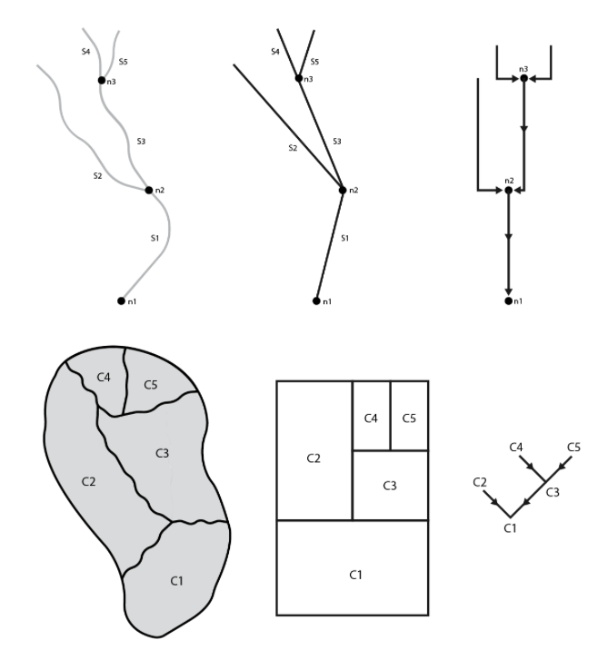
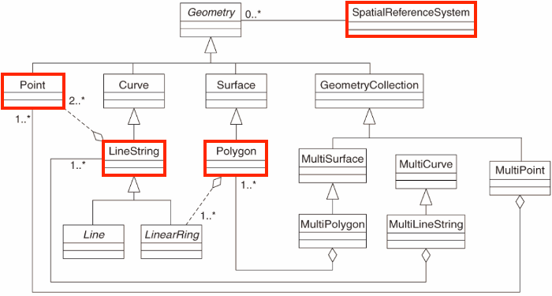

```{r setup, include=FALSE}
knitr::opts_chunk$set(echo = TRUE, out.width = "100%", message = TRUE)
library(sf); library(mapview)
```

# What is a hydrofabric?

The first question generally raised is, "_what is a hydrofabric_?" To date, the term has been been used to describe artifacts as narrow as a set of cartographic lines, all the way to the entire spatial data architecture needed to map and model the flow of water and flood extents. 
For our purposed here, the hydrofabric is the foundational base data that allows NextGen to run. It provides 

  -  the landscape and flow network _discritizations_ 
  -  the _connectivity_ (topology) of the network features
  -  and the locations _where information will be reported_ (nexus's)

The hydrofabric also establishes a system of _linked data_ and Web infrastructure that can relate to, and extract from, linked sources like: 

  - the USGS Next Generation Monitoring Location Pages (e.g. [here](https://waterdata.usgs.gov/monitoring-location/06752260/))
  - The Internet of Water Geoconnex PID registry (e.g. [here](https://reference.geoconnex.us/collections))
  - climate-catalogs (e.g. [here](https://github.com/mikejohnson51/climateR-catalogs))
  - landscape characteristic catalogs 
  
```{r, echo = FALSE}
knitr::include_graphics('../man/figures/what-is-a-hydrofabric.png') 
```

## Who cares about a hydrofabric?

Discritizing the land surface into computational elements is fundamental to all modeling tasks. Without it, distributed and lumped models have no way to apply the needed model formulations or computer science applications to achieve meaningful results. Therefore anyone who cares about the science and application of water resource modeling should care about the underlying data as it drives the locations where forecasts are made, the attributes that inform a model, and the spatial elements in which formulation are valid.

However, describing the earths surface - particularly at continental scales - is a tricky task. Automated techniques can get us a long way in representation, however the modeling task at hand and local knowledge should be used in developing an authoritative product. Through time, local knowledge has been collected in a number of places, but never centralized. Further, one off products (like the NHDPlus) have been used to guide all modeling task even in cases when its resolution, or representation is not well suited.

The aim of NOAAs work in this space is to develop a federal reference fabric to support all flavors of modeling, and a national instance of that reference fabric to support heterogeneous model application.

Equally important is the software tools to support flexibility and community uptake; the data models to support interoperability, community engagement, and long term stability; and a reference data set with the quality assurances that when one uses the product they are getting a well vetted resource that will be able to play nicely with the growing Ngen framework.


# Current Version:

The most up to date NextGen hydrofabric and resources can be accessed from the public facing [Lynker AWS account](https://www.lynker-spatial.com/index.html).

In practice we strive to develop these products to take advantage of the following:

### Leading data science

#### Formats:

  - [GPKG](https://www.geopackage.org)
  - Arrow/[Parquet](https://parquet.apache.org/docs/overview/) Tables
  
#### Access Patterns: 

  - [GDAL VSI](https://www.google.com/url?sa=t&rct=j&q=&esrc=s&source=web&cd=&cad=rja&uact=8&ved=2ahUKEwil-fWKx_D-AhWCIzQIHXIHDD4QwqsBegQIAxAE&url=https%3A%2F%2Fwww.youtube.com%2Fwatch%3Fv%3DauK_gPR-e7M&usg=AOvVaw2ITVtXkwdDj5PCzIfSQwbW) 
  - [SQLITE](https://sqlite.org/index.html)
  - [Arrow](https://arrow.apache.org)
  
#### Distribution System

  - [s3](https://docs.aws.amazon.com/AmazonS3/latest/userguide/Welcome.html) (through AWS)
  - [ScienceBase](https://www.usgs.gov)


### Hydroscience Conceptual Models & Web Infastrucutre

 - The hydrofabric features are grounded in the OGC [HY Feature conceptual model](https://docs.opengeospatial.org/is/14-111r6/14-111r6.html).
 
 
```{r, echo = FALSE}

```
 
 - The [Mainstems logical model](https://www.sciencedirect.com/science/article/pii/S1364815220309841)
 
 - The OGC Engineering Report ["Hydrologic Modeling and River Corridor Applications of HY_Features Concepts"](https://docs.ogc.org/per/22-040.html)

 - The Network Linked Data Index (NLDI) [here](https://waterdata.usgs.gov/blog/nldi-intro/), and [here](https://rconnect.usgs.gov/dataRetrieval/articles/nldi.html) and [here](https://hyriver.readthedocs.io/en/latest/autoapi/pynhd/pynhd/index.html)
 
 - The [Geoconnex Registry](https://geoconnex.internetofwater.dev)
 

### Formal Realization Representations

- The conceptual model laid out in HY Features is conflated with the [Simple Feature Access](https://www.ogc.org/standard/sfa/) Spatial Data model to provide a logical model for how the feature realizations are represented in the hydrofabric data model.

```{r, echo = FALSE}

```


# What's to follow:

1) The basic software package for working with these products
2) The design of this system
3) The two primary processes of processes of network manipulation - refactoring and aggregating
4) The fundamental data model used for hydrofabrics
5) How to extract subsets of the data for you needs
6) (time permitting) how to access and build landscape characteristics

As potential users, and contributors, the place where you want to jump in is use case specific.

The following steps walk you through the concepts and tools for building and understanding a NextGen ready dataset, what the outputs look like, and how you might interact with them.

# Software

Extracting subsets from the primary hydrofabric data product does not require code, however, if you are eager to build, modify and expand on the existing products the 

```{r, eval = FALSE}
remotes::install_github("NOAA-OWP/hydrofabric")
```

Hydrofabric itself only contains a few functions for subsetting the national product. Instead it provides a easy install for a variety of hydroscience, data science, and spatial libraries that are needed.

Attaching this library, similar to the `tidyverse`, installs and loads a canon of software designed to manipulate, modify, describe, process, and quantify hydrologic networks and land surface attributes:

```{r}
library(hydrofabric)
```

It includes the following:

| Repo        | Purpose           | 
| ------------- |:-------------:| 
| dplyr      | Provides a consistent set of tools for data manipulation | 
| USGS-R/nhdplusTools      | Tools for for network manipulation | 
| terra      | Methods for spatial data analysis with vector (points, lines, polygons) and raster (grid) data | 
| NOAA-OWP/hydrofab      | Tools for working with the reference fabric, along with network refactoring and aggregation | 
| NOAA-OWP/ngen.hydrofab      | Extensions for building NextGen ready data products | 
| mikejohnson51/zonal      | Tools for rapid areal summarization |
| mikejohnson51/climateR      | Tools for for accessing remote data resources for parameter and attributes estimation | 
| glue      | Provides interpreted string literals that are small, fast, and dependency-free | 
| sf      | Provides simple features access for R | 
| arrow      | Exposes an interface to the Arrow C++ library | 

# Today's Context

Everyone should have a USGS Gage ID in mind. For my example, we will use NWIS `gage=06752260` that sits on the Cache La Poudre River in Fort Collins, Colorado. 

  - The associated gpkg can be found [here](https://lynker-spatial.s3.amazonaws.com/tutorial/poudre.gpkg)
  
  - The USGS Next Generation Monitoring Location Page for this site is here: https://waterdata.usgs.gov/monitoring-location/06752260/
  - The Geoconnex PID can be found here: https://reference.geoconnex.us/collections/gages/items?provider_id=06752260
  
```{r, echo = FALSE}
knitr::include_graphics("../man/figures/hydrofabric.png")
```


For those cases where we need to download data, we are also setting up a directory in our main working directory.

```{r}
dir.create("tutorial", showWarnings = FALSE)
```
  

