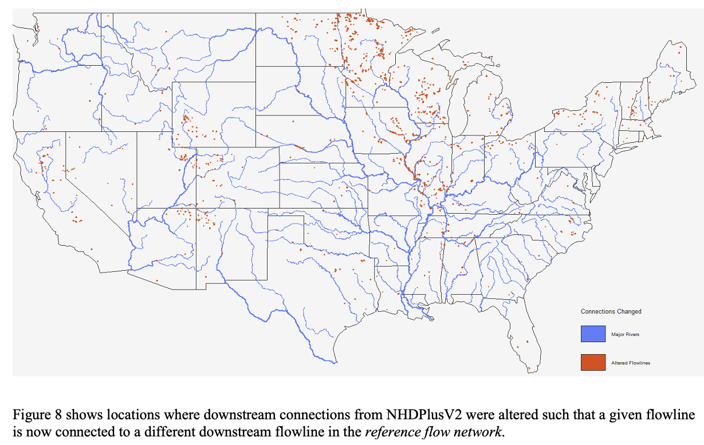

```{r setup, include=FALSE}
knitr::opts_chunk$set(echo = TRUE)
library(ggplot2);library(hydrofabric)
base <- "tutorial"
dir.create(base, showWarnings = FALSE)
base_gpkg = "/Users/mikejohnson/hydrofabric/CONUS/v2.2/nextgen/ls_conus.gpkg"
```

# How do we arrive at the NextGen Hydrofabric?

- The NextGen model engine is intended to be _model agnostic_.

- The hydrofabric is meant to be _Model Application Agnostic_. 

- This means that the hydrofabric should be able to support the modeling needs of applications like:

    1. NOAA NextGen (in its infinite flavors); 
    2. the USGS NHM; 
    3. the USGS SPARROW model; 
    4. and eventually NOAA FIM.
    
# The USGS-NOAA Reference Fabric

- For a single system to serve many - often distinct - modeling applications, there needs to be a set reference (analogous to a coordinate reference system (CRS))

- This reference system must provide the maximum (e.g. smallest discretization) set of features "allowable" for all interrelated model applications.

  - Right now, this is the NHDPlusV2 (with modifications)
  - In the future it will move to NHDHighRes and 3DHP
  - In practice, reference fabrics can be built from other hydrographies (e.g. NGA TDX and MERIT)
  
- A reference fabric is key to providing persistent identification (PID) for durable data integration and model interoperability

- The development of this product has been collaborative venture between the USGS Water Mission Area, the NOAA Office of Water Prediction, and Lynker.

```{r, echo = FALSE}
knitr::include_graphics('../man/figures/logos.png')
```

More on this has been documented [here](https://waterdata.usgs.gov/blog/hydrofabric/) 

## The 3 pillars of a Reference Fabric

```{r, echo = FALSE}
knitr::include_graphics('../man/figures/level1.png')
```

### 1. Reference Fabric

  - Simple, valid, representations of all `flowpath` and `divide` features
  
  - Must be derived from a *source* hydrographic dataset (e.g. NHDPlusV2, or Dihydro)
  
  - Currently, these are built out from the NHDPlusV2 features
  
  - **Waterbodies** are simplified, islands are dissolved, and they are unioned on GNIS_ID.
    
```{r, echo = FALSE}
knitr::include_graphics("../man/figures/cleaning_waterbodies.gif")
```

   - **Catchments** are simplified, and DEM fragments are dissolved into the proper adjoining catchments.
    
```{r, echo = FALSE}
knitr::include_graphics("../man/figures/cleaning_catchments.gif")
```
    
   - **Flowpaths** are ensured to be digitized from upstream to downstream and the burn line events are substituted for the NHDFlowlines in headwater catchments
    
  - These data products can be found[here](https://www.sciencebase.gov/catalog/item/6317a72cd34e36012efa4e8a)

  
### 2. Reference Topology

  - Since its release, the NHDPlus topology and value added attributes have been stable
  
  - Local groups and agencies have made modifications to this but these have never made it back into the primary source
  
  - Improvements made by the USGS, OWP, NCAR and others have been integrated to provide an updated network connectivity. 
  
  - This data product can be found [here](https://www.sciencebase.gov/catalog/item/63cb311ed34e06fef14f40a3) and is described in the upcoming article "Generating a reference flow network with improved connectivity to support durable data integration and reproducibility in the coterminous US" {In press at EMS}
  
#### Connecting previously "terminal" flowlines back to the network 
  
```{r, echo = FALSE}
knitr::include_graphics('../man/figures/figure6.png')
```

#### Corrected divergence priorities
  
```{r, echo = FALSE}

```

- Ultimately a changed network as shown by areas where the total drainage area is more then 10% different then the original NHDPlusV2 Network.

```{r, echo = FALSE}
knitr::include_graphics('../man/figures/figure9.png')
```


### 3. Community Points of Interest (POI)

Points of Interest (POIs) for hydrologic modeling are collected from a variety of of published data sources. These include ones like the Army Corp National Inventory of Dams and the USGS Gages III gage database
  
```{r, echo = FALSE, eval = FALSE, warning=FALSE}

df = as_ogr(base_gpkg, "hydrolocations") |> 
  select("hl_source", 'hl_reference', "hl_link") |>
  distinct() |> 
  collect() |>
  group_by(hl_reference) |>
  tally(name = "Count")

ggplot(df) + 
  geom_col(aes(y = hl_reference, x = Count), position = "dodge") + 
  geom_text(aes(label = scales::number(Count, big.mark = ","), 
                y = hl_reference,  
                x = Count + 4000)) + 
  theme_light() + 
  labs(title = "POI Type Counts", y = "", x = "Number")

ggsave(filename = "../man/figures/poi_dist.png")
```

  - POIs become `hydrolocations` at the _outflow_ of the linked `flowpath` through a robust hydrologic indexing scheme.
  
  - **NOTE**: These are locations that have been deemed of high _general_ interest. There is no guarantee all gages, dams, thermoelectric plants are in the community set.

# What is a VPU?

A VPU is a **V**ector **P**rocessing **Unit**. The USGS determined these regions when designing the NHDPlusV2. Since our work builds off the NHDPlusV2, we adopt these processing units.

```{r, echo = FALSE}
x = hydrofab::vpu_boundaries[1:21,]

ggplot(data = x) + 
  geom_sf(data = x) + 
  geom_sf_label(aes(label = VPUID)) + 
  theme_void()
```

All hydrographic networks have VPU-esque discritizations. The key is that the source hydrofabric discritization can be retained through the manipulation process.

Below we show the tiling and drainage basin approaches of MERIT-hydro, BasinMaker, and NGA's TDX-hydro.

```{r, echo=FALSE, out.width="32%",fig.cap="caption",fig.show='hold',fig.align='center'}
knitr::include_graphics(c('../man/figures/merit-hydro.png', '../man/figures/basinmaker.png',  '../man/figures/nga-tdx.png'))
```


# Getting the reference fabric

All reference products live on Lynker Spatial s3 account. They can be accessed with the web interface.

Ok! With that, we have an idea of what the reference fabric is, how it was made, and how we can get it! The next stage is to learn how to manipulate this reference fabric for unique model applications. 
