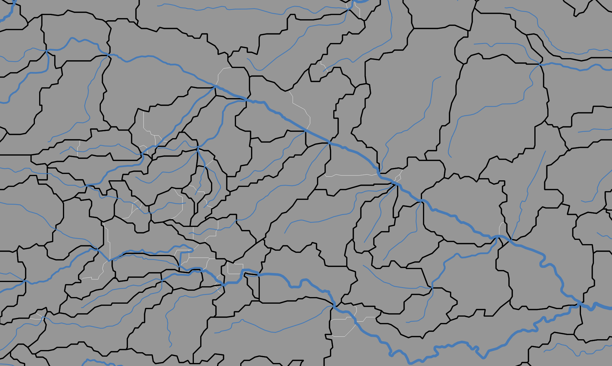
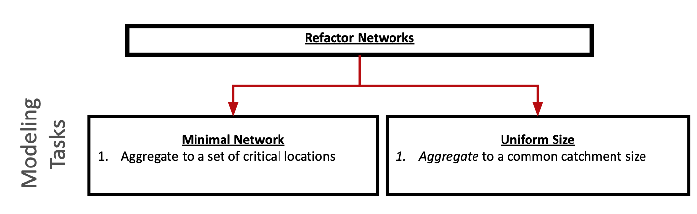

```{r setup, include=FALSE}
knitr::opts_chunk$set(  collapse = TRUE,
  comment = "#>",
  out.width = "100%",
  warning = FALSE, message = FALSE)
library(hydrofabric)
library(mapview)
library(ggplot2)
```

# Network Manipulation: Geoprocessing

```{r, echo = FALSE}
knitr::include_graphics('../man/figures/level2.png')
```

# Getting the reference fabric

All reference and (precomputed) refactored data products live on ScienceBase. They can be accessed with the web interface or can be downloaded programatically. The `hydrofab::get_hydrofabric()` utility will download the most current geofabric for a Vector Processing Unit (VPU). Options include downloading the "refactored" (default) or "reference" data. If the requested file already exists, the file path will be returned. 

## Example

- To exemplify this process we do the following:
  1. Define a terminal location of interest
  2. Subset the upstream reference fabric using `hydrofab::subset_reference`

```{r, eval = FALSE}
library(hydrofabric)

# Define starting feature by source and ID
(nldi_feature = list(featureSource = "nwis", featureID = "06752260"))

# Use this feature to build a reference subset
  # This function uses the NLDI to identify an upstream tributary
  # and SQL to extract a subset GPKG
subset_reference(nldi_feature = nldi_feature, 
                 gpkg = get_hydrofabric(VPU = "10L",  type = "reference", dir = "cihro-data"),
                 export_gpkg = "cihro-data/reference.gpkg")
```

# 1) Running the Process: Refactoring

## Concept

- Refactoring is a geoprocessing workflow that seeks to 

   1. Split large or long catchments into a more uniform catchment size distribution and
   2. collapse catchment topology to eliminate small catchments
   
- The fundamental key is that no network resolution is lost! That means the total path length of the network going in, is what comes out.

- The workflow is can be parameterized using three primary values:

| Parameter        | Purpose           | Elected Value  | 
| ------------- |:-------------:| -----:| 
| split_flines_meters      | the maximum length flowpath desired in the output. | 10,000|
| collapse_flines_meters      | the minimum length of inter-confluence flowpath desired in the output. | 1,000 |
| collapse_flines_main_meters      | the minimum length of between-confluence flowpaths.| 1,000 |

You might also have areas where you want to avoid, or, enforce a splitting event. These can be defined with the following values:

| Parameter        | Purpose  | 
| ------------- |:-------------:|
| exclude_cats      | 	integer vector of COMIDs to be excluded from collapse modifications. |
| events      | data.frame containing events as generated by get_flowline_index() |

- POI definition and selection is _model application specific_. Here, we will ignore this aspect.

- With only information about the network, refactor can only refactor the flowpath network. 

- In order to reconcile the catchment network,a set of flow accumulation (FAC) and flow direction (FDR) grids must be provided.

 - For the reference fabric (e.g. NHDPlusV2), we supply a national VRT for each of these that can be accessed at: `s3://nextgen-hydrofabric/DEM-products/{product}.vrt`
 
- These (and other gridded products) can be found [here](https://nextgen-hydrofabric.s3.amazonaws.com/index.html#DEM-products/)
 
## Example

```{r, eval = FALSE}
refactor = refactor(gpkg = "cihro-data/reference.gpkg",
                    split_flines_meters = 10000, 
                    collapse_flines_meters = 1000, 
                    collapse_flines_main_meters = 1000,
                    fac = '/vsis3/nextgen-hydrofabric/gridded-resources/fac.vrt',
                    fdr = '/vsis3/nextgen-hydrofabric/gridded-resources/fdr.vrt',
                    outfile = "cihro-data/refactor.gpkg")
```

## Outputs 

To get a high level understanding of what happened with this "refactor", we can look at the length distributions:

```{r, echo = FALSE}
reference = read_hydrofabric("cihro-data/reference.gpkg")
refactor  = read_hydrofabric("cihro-data/refactor.gpkg")

refactor$flowpaths$LENGTHKM = add_lengthkm(refactor$flowpaths)
refactor$catchments$areasqkm = add_areasqkm(refactor$catchments)

reference$catchments$areasqkm = add_areasqkm(reference$catchments)
reference$flowpaths$LENGTHKM = add_lengthkm(reference$flowpaths)

ggplot() + 
  geom_density(data = refactor$flowpaths, aes(x = LENGTHKM), color = "blue", lwd = 3) + 
  geom_density(data = reference$flowpaths, aes(x = LENGTHKM), color = "red", lwd = 3) + 
  xlim(0,10) +
  ylim(0,.75) +
  geom_vline(xintercept = 1, size = 1) + 
  theme_light() + 
  labs(x = "Length (km)", y = "Density",  title = "Length Distribution", 
       subtitle = paste0(sum(reference$flowpaths$LENGTHKM >= 10), ' flowlines from reference (>10 km)\n',
                         sum(refactor$flowpaths$LENGTHKM >= 10), ' flowpaths removed from reference (>10 km)')) +
  geom_label( aes(x=1, y=0.75, label= "Minimum Length"), color="black") +
  geom_label( aes(x=2, y=0.5, label=paste(nrow(reference$flowpaths), "\nreference flowlines")), color="red", fill = "white") +
  geom_label( aes(x=5, y=0.2, label= paste(nrow(refactor$flowpaths), "\nrefactored flowpaths")), color="blue", fill = "white") 
```

And the area distributions:

```{r, echo = FALSE}
ggplot() + 
  geom_density(data = refactor$catchments, aes(x = areasqkm), color = "blue", lwd = 3) + 
  geom_density(data = reference$catchments, aes(x = areasqkm), color = "red", lwd = 3) + 
  xlim(0,25) +
  ylim(0,.6) +
  geom_vline(xintercept = 3) + 
  geom_vline(xintercept = 10, size = 1) + 
  geom_vline(xintercept = 15) + 
  theme_light() + 
  labs(x = expression("Area (km²)"),  title = "Area Distribution", 
       subtitle = paste0(sum(reference$catchments$areasqkm >= 25), ' catchments removed from reference (>25 km²)\n',
                         sum(refactor$catchments$areasqkm >= 25), ' divides removed from refactored (>25 km²)')) +
  annotate("rect", xmin = 3, xmax = 15, ymin = 0, ymax = .6,  alpha = .1) + 
  scale_y_continuous("Density", expand = c(0,0)) + 
  geom_label( aes(x=10, y=0.5, label= "Idealized Range"), color="black") +
  geom_label( aes(x=4, y=0.4, label=paste(nrow(reference$catchments), "\nreference catchments")), color="red", fill = "white") +
  geom_label( aes(x=6.5, y=0.2, label= paste(nrow(refactor$catchments), "\nrefactored divides")), color="blue") 
  
```

Lastly, we look at the feature count of the network:

```{r, echo = FALSE}

d = data.frame(type = c("Reference", "Refactor"), num = c(nrow(reference$catchments), nrow(refactor$catchments)))

ggplot() + 
  geom_col(data = d, aes(x = type, y = num)) + 
  theme_light() +
  labs(title = "Reference vs Refactor Features", x = "Type", y = "Number of Features")
  
```


- Finally, we can zoom into a layer of this network to see what changes exist.

- In the figure below, the white edges represent the `reference` catchment network, while the black edges represent the refactored network

- Since refactoring requires the preservation of the flowpath network, the blue lines are representative of both the reference and refactored network with the caveat they are broken and different places.

```{r, echo = FALSE}

```


# 2. Running the Process: Aggregating

- Aggregation is a primarily a divide oriented workflow. It collapses the network to provide a new discretization.

- Two aggregation methods:
    - To POIs - you define network outlets (NHM and SPARROW)
    - To a statistical distribution, with or w/o enforced POIs (NextGen).

```{r, echo = FALSE}

```


| Parameter        | Purpose           | Elected Value  | 
| ------------- |:-------------:| -----:| 
| ideal_size_sqkm      | the maximum length flowpath desired in the output. | 10 |
| min_length_km      | the minimum length of inter-confluence flowpath desired in the output. | 1 |
| min_area_sqkm      | the minimum length of between-confluence flowpaths. | 3 |


Here, a `hydrolocation` POINT layer can be passed to help direct the aggregation, but for simplicity is ignored here:

## Example

```{r, eval = FALSE}
aggregate_to_distribution(gpkg = "cihro-data/refactor.gpkg",
                          ideal_size_sqkm = 10, 
                          min_length_km = 1, 
                          min_area_sqkm = 3, 
                          outfile = "cihro-data/aggregate.gpkg")

```

## Outputs 

To get a high level understanding of what happens with this "refactor", we can look at the length distributions:

```{r, echo = FALSE}
agg = read_hydrofabric("cihro-data/aggregate.gpkg")

ggplot() + 
  geom_density(data = refactor$flowpaths, aes(x = LENGTHKM), color = "blue", lwd = 3) + 
  geom_density(data = reference$flowpaths, aes(x = LENGTHKM), color = "red", lwd = 3) + 
  geom_density(data = agg$flowpaths, aes(x = lengthkm), color = "green", lwd = 3) + 
  xlim(0,10) +
  ylim(0,.75) +
  geom_vline(xintercept = 1, size = 1) + 
  theme_light() + 
  labs(x = "Length (km)", y = "Density",  title = "Length Distribution", 
       subtitle = paste0(sum(reference$flowpaths$LENGTHKM >= 10), ' flowlines from reference (>10 km)\n',
                         sum(refactor$flowpaths$LENGTHKM >= 10), ' flowpaths removed from refactored (>10 km)\n',
                         sum(agg$flowpaths$lengthkm >= 10), ' flowpaths removed from aggregated (>10 km)\n')) +
  geom_label( aes(x=1, y=0.75, label= "Minimum Length"), color="black") +
  geom_label( aes(x=2, y=0.5, label=paste(nrow(reference$flowpaths), "\nreference flowlines")), color="red", fill = "white") +
  geom_label( aes(x=5, y=0.3, label= paste(nrow(refactor$flowpaths), "\nrefactored flowpaths")), color="blue", fill = "white") +
  geom_label( aes(x=8, y=0.2, label= paste(nrow(agg$flowpaths), "\naggregated flowpaths")), color="darkgreen", fill = "white")
```

And the area distributions:

```{r, echo = FALSE}
ggplot() + 
  geom_density(data = refactor$catchments, aes(x = areasqkm), color = "blue", lwd = 3) + 
  geom_density(data = reference$catchments, aes(x = AREASQKM), color = "red", lwd = 3) + 
  geom_density(data = agg$catchments, aes(x = areasqkm), color = "green", lwd = 3) + 
  xlim(0,25) +
  ylim(0,.6) +
  geom_vline(xintercept = 3) + 
  geom_vline(xintercept = 10, size = 1) + 
  geom_vline(xintercept = 15) + 
  theme_light() + 
  labs(x = expression("Area (km²)"),  title = "Area Distribution", 
       subtitle = paste0(sum(reference$catchments$AREASQKM >= 25), ' catchments removed from reference (>25 km²)\n',
                         sum(refactor$catchments$areasqkm >= 25), ' divides removed from refactored (>25 km²)\n',
                         sum(agg$catchments$areasqkm >= 25), ' divides removed from aggregated (>25 km²)\n')) +
  annotate("rect", xmin = 3, xmax = 15, ymin = 0, ymax = .6,  alpha = .1) + 
  scale_y_continuous("Density", expand = c(0,0)) + 
  geom_label( aes(x=10, y=0.5, label= "Idealized Range"), color="black") +
  geom_label( aes(x=4, y=0.4, label=paste(nrow(reference$catchments), "\nreference divides")), color="red", fill = "white") +
  geom_label( aes(x=6.5, y=0.22, label= paste(nrow(refactor$catchments), "\nrefactored divides")), color="blue")  +
   geom_label( aes(x=15, y=0.1, label= paste(nrow(agg$catchments), "\naggregated divides")), color="darkgreen", fill = "white")
  
```

- Finally, we can zoom into a layer of this network to see what changes exist.

- In the left-hand figure below, the white edges represent the `reference` catchment network, the black edges represent the refactored network, and the red represnet the aggregated network

- In the right-hand figure, we can see the blue flowlines (from reference and refactor) that were prunned in the aggregation process.


```{r, echo=FALSE,out.width="49%",fig.show='hold',fig.align='center'}
knitr::include_graphics(c('../man/figures/catchment-dissolving.png', '../man/figures/river-pruning.png'))
```


Lastly, we can look at the cumulative network traits of each fabric:

```{r, echo=FALSE}
data.frame(class=rep(c("Flowpath Length", "Divide Area"), each=3),
                  type=rep(c("Reference", "Refactored", 'Aggregated'),2),
                  num = c(sum(reference$flowpaths$LENGTHKM),
sum(refactor$flowpaths$LENGTHKM),
sum(agg$flowpaths$lengthkm),
sum(reference$catchments$AREASQKM),
sum(refactor$catchments$areasqkm),
sum(agg$catchments$areasqkm))) %>% 
ggplot(aes(x=class, y=num, fill=type)) +
  geom_bar(stat="identity", color="black", position=position_dodge())+
  theme_minimal() + 
  scale_fill_manual(values=c('green', 'blue','red'))
```

The refactored output is shared under the Refactored Parent item of the above ScienceBase resource (available [here](https://www.sciencebase.gov/catalog/item/61fbfdced34e622189cb1b0a)). It is also avaliable in the Lynker s3 account here

# 3) NextGen

Once we have a network aggregated to a scale matching the desired hydrologic processes we need to turn it into something NextGen can use (modeling task)

```{r, echo=FALSE}
knitr::include_graphics('../man/figures/roadmap.png')
```

## Divergent Topology 

Nextgen operates on a `[flowpath --> nexus]` vs `[flowpath --> flowpath]` topology

This is due to the HY Features conceptula catchment that has 1 inflow draining to one outflow.

And example of this can be seen below:

```{r, echo=FALSE,out.width="49%",fig.cap="caption",fig.show='hold',fig.align='center'}
knitr::include_graphics(c('../man/figures/topology.png', '../man/figures/topology2.png'))
```

## Character based indentification

Nextgen requires integer based identification, like described in the data model, prefixed with a character string defining what the feature is

Right now, the following prefixs are used to distiguish between type of model features.

| Parameter        | Purpose           | Elected Value  | 
| ------------- |:-------------:| -----:| 
| nexus_prefix      | the maximum length flowpath desired in the output. | "nex-" |
| terminal_nexus_prefix      | the minimum length of inter-confluence flowpath desired in the output. | "tnx-" |
| coastal_nexus_prefix      | the minimum length of between-confluence flowpaths. | "cnx-" |
| internal_nexus_prefix      | the maximum length flowpath desired in the output. | "inx-" |
| catchment_prefix      | the minimum length of inter-confluence flowpath desired in the output. | "cat-" |
| waterbody_prefix      | the minimum length of between-confluence flowpaths. | "wb-" |


The following function (1) identifies nexus locations, (2) moves them when needed and (3) applies the above schema to the features.

```{r, eval = FALSE}
apply_nexus_topology(gpkg = "cihro-data/aggregate.gpkg", export_gpkg = "cihro-data/nextgen.gpkg")
```

We can see the results of this by opening the hydrofabric and adding it to a map!

```{r}
nexus = read_sf("cihro-data/nextgen.gpkg", "nexus") 

read_hydrofabric("cihro-data/nextgen.gpkg") %>% 
  mapview() + 
  nexus
```

## Extending NWM attributes

The core utilities provide a series of flowpath, divide, and nexuses.

```{r}
sf::st_layers("cihro-data/nextgen.gpkg")
```
However, other information is needed to run some/all NextGen formulations. These include the following:

### Lake Attributes

- WBOut Hydrolocations are mapped to the NHDPlusWaterBody COMIDs used in the NWM.

## Flowpath Attributes

- Flowpath attributes are extracted from the a Routelink file
- The values are length averaged by the portion of length each makes up in the refactored/aggregated network 

For example, if a 75m flowline has a roughness of 0.05 and a 25m flowline with a roughness of 0.2

```{r}
(n = (.75 * .05) + (.25 * .2))
```


Flowpaths attributes and lake parameters can be added by pointing to a set of NWM domain files like those found [here](https://www.nco.ncep.noaa.gov/pmb/codes/nwprod/nwm.v2.2.3/parm/domain/)

```{r, eval = FALSE}
add_flowpath_attributes("cihro-data/nextgen.gpkg", 
                        rl_path = "/Volumes/MyBook/nextgen/RouteLink_nwm_v2_2_3.fst") %>%
   add_lake_attributes(lake_path = '/Volumes/Transcend/nwmCONUS-v216/LAKEPARM_CONUS.nc')
```


## CFE/NOAH-OWP attributes

Catchment attribute data is needed to run some formulations like CFE and NOAH-OWP. These can be computed using the following logic. 

```{r, eval = FALSE}
 add_cfe_noahowp_attributes(gpkg        = 'cihro-data/nextgen.gpkg"',
                            nwm_dir     = "/Volumes/Transcend/nwmCONUS-v216/",
                            outfile     = 'cihro-data/cfe_noahowp.parquet')
```

By default, this code take the gridded data supplied by the `soilproperties_CONUS_FullRouting.nc`, `wrfinput_CONUS`, and `GWBUCKPARM_CONUS_FullRouting.nc` and computes the following summaries:


| Tables        | Description           | Layer(s)  | Summary Function | Source | 
| ------------- |:-------------:| -----:| -----:| -----:|
| bexp      | Beta Parameter| 4 | mode | soilproperties_CONUS_FullRouting.nc |
| IVGTYP      | Dominant category    | 1   | mode | wrfinput_CONUS.nc |
| ISLTYP | Dominant category      |  1   | mode | wrfinput_CONUS.nc |
| dksat      | Saturated Soil Connectivity | 4  | geometric mean | soilproperties_CONUS_FullRouting.nc |
| psisat      | Saturated soil matric potential      | 4   | geometric mean | soilproperties_CONUS_FullRouting.nc |
| slope | Slope Index      |   1 | mean | soilproperties_CONUS_FullRouting.nc |
| smcmax      | Saturated value of soil moisture [volumetric] | 4 | mean | soilproperties_CONUS_FullRouting.nc |
| smcwlt      | Wilting point soil moisture [volumetric]     |  4  | mean | soilproperties_CONUS_FullRouting.nc |
| refkdt | Parameter in the surface runoff parameterization      |  1  | mean | soilproperties_CONUS_FullRouting.nc |
| cwpvt      | Empirical canopy wind parameter | 1 | mean | soilproperties_CONUS_FullRouting.nc |
| vcmx25      | Maximum rate of carboxylation at 25 C [ umol CO2/m2/s]      | 1  | mean | soilproperties_CONUS_FullRouting.nc |
| mp | Slope of Conductance to photosynthesis relationship      | 1   | mean | soilproperties_CONUS_FullRouting.nc |
| mfsno      | Snowmelt m parameter | 1 | mean | soilproperties_CONUS_FullRouting.nc |
| Coef      | Coefficient | 1 | mean | GWBUCKPARM_CONUS_FullRouting.nc |
| Zmax      | Zmax | 1 | mean | GWBUCKPARM_CONUS_FullRouting.nc |
| Expon      | Exponent | 1 | mode | GWBUCKPARM_CONUS_FullRouting.nc |
| Quartz      | Soil Quartz | 4 | mean | soilproperties_CONUS_FullRouting.nc |
 

### Themeing

As an option, QGIS QML theming files can be added to a gpkg. Some default themeing files come with hydrofabric and can be specified/added with the `append_styles` utility on the desired `layer_names`

```{r, eval = FALSE}
append_style("cihro-data/nextgen.gpkg", layer_names = c("nexus", "hydrolocations", "flowpaths", "divides", "lakes"))
```

In [QGIS](https://qgis.org/en/site/forusers/download.html), double clicking the gpkg file will allow you to select which layers to load.


```{r, echo = FALSE}
knitr::include_graphics("../man/figures/hydrofabric.png")
```


# Full Run-through

```{r, eval = FALSE}

reference_gpkg = get_hydrofabric(VPU = "10L",  type = "reference", dir = "cihro-data")

# Define starting feature by source and ID
list(featureSource = "nwis", featureID = "06752260") %>% 
  # Subset Reference
  subset_reference(gpkg = reference_gpkg,
                   export_gpkg = "cihro-data/reference.gpkg")


  refactor(gpkg = "cihro-data/reference.gpkg",
           split_flines_meters = 10000, 
           collapse_flines_meters = 1000, 
           collapse_flines_main_meters = 1000,
           fac = '/vsis3/nextgen-hydrofabric/gridded-resources/fac.vrt',
           fdr = '/vsis3/nextgen-hydrofabric/gridded-resources/fdr.vrt',
           outfile = "cihro-data/refactor.gpkg") %>% 
  aggregate_to_distribution(ideal_size_sqkm = 10, 
                          min_length_km = 1, 
                          min_area_sqkm = 3, 
                          outfile = "cihro-data/aggregate.gpkg") %>% 
  apply_nexus_topology(export_gpkg = "cihro-data/nextgen.gpkg") %>% 
  add_flowpath_attributes(rl_path = "/Volumes/MyBook/nextgen/RouteLink_nwm_v2_2_3.fst") %>%
  add_lake_attributes(lake_path = '/Volumes/Transcend/nwmCONUS-v216/LAKEPARM_CONUS.nc') %>%
  append_style(layer_names = c("nexus", "hydrolocations", "flowpaths", "divides", "lakes"))

add_cfe_noahowp_attributes(gpkg        = 'cihro-data/nextgen.gpkg"',
                           nwm_dir     = "nwm-data",
                           outfile     = 'cihro-data/cfe_noahowp.parquet')
```


## nhdplusTools:

With all network manipulations, fundamental network traits change. This requires the utilities to rapidly and efficiently recopute key network metric. The nhdplusTools package provides the option to regenerate all or some of these on the fly using graph algroithms and logic. 

We will return to the `get_sorted()` utility in the subsetting section

```{r, eval = FALSE}
nhdplusTools::add_plus_network_attributes()
nhdplusTools::get_streamorder()
nhdplusTools::calculate_total_drainage_area()
nhdplusTools::get_sorted()
```

```{r, echo = FALSE}
knitr::include_graphics('../man/figures/figure7.png')
```
