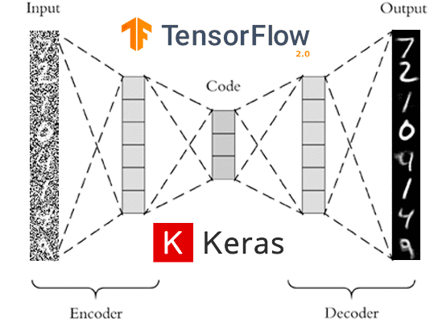
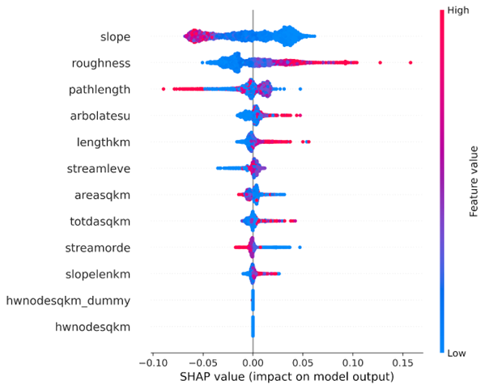
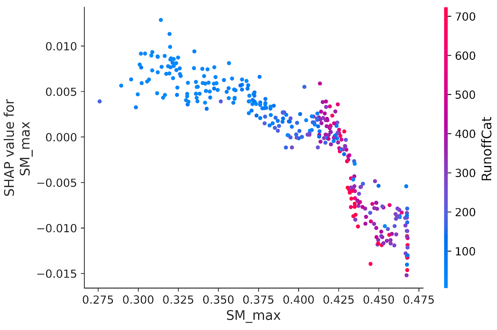
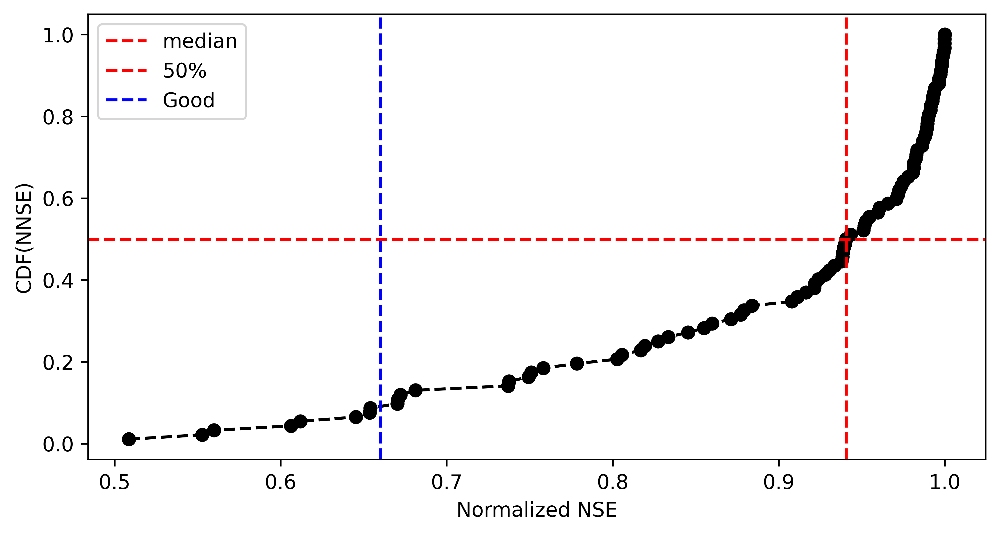
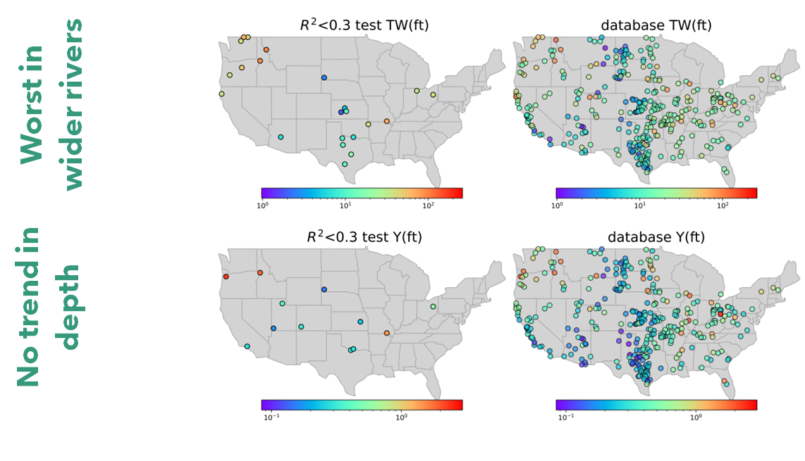

# A ML approach to estimate channel geometry

**Check out our [website](https://sites.google.com/u.boisestate.edu/conus-fhg/home) that provides details of our approach.** 


## What is FHG?

The feature hydraulic geometry (FHG) is an extension of the work by [Leopold and Maddock, 1953](https://books.google.com/books?hl=en&lr=&id=K496gE_YsJoC&oi=fnd&pg=PA1&dq=Leopold,+L.B.,+Maddock,+Jr.,+T.,+1953.+The+hydraulic+geometry+of+stream+channels+and+some+physiographic+implications.+US+Geological+Survey+Professional+Paper+252.&ots=FjrJEtp6Cj&sig=82Sl3dnacB4uUM4DY59nObbi6mQ) to apply the learned hydraulic geometry relations to other locations with the same holistic hydrologic feature. 

The hydraulic geometry relations suggest that measured hydraulic characteristics at a channel cross-section including width, depth, and velocity vary with discharge as a simple power-law function. These relations present an opportunity to develop a time-varying representation of channel depth and width and in turn, can determine the shape of the channel. 

## Why build a machine learning model?

Currently, Digital Elevation Model's (DEM) can be used to extract floodplain topology but DEMs cannot penetrate deep into the water and thus we have a missing bathymetry at bankfull and below bankfull conditions. This missing bathymetry can through off modeling efforts by not accounting for the missing volume. The hydraulic geometry method offers a solution to capture the missing bathymetry and resolve this issue.

Deriving hydraulic geometry relations is only possible where there are measurements of width, depth, and velocity at different discharge values such as few selected USGS sites or locations where there are frequent measurements of Acoustic Doppler Current Profiler (ADCP). A great source of such a dataset is the USGS HYDRoacoustic dataset in support of the Surface Water Oceanographic Topography satellite mission [HYDRoSWOT](https://data.usgs.gov/datacatalog/data/USGS:57435ae5e4b07e28b660af55). This limits the applicability of this approach only to sites where such measurements have taken place. 

The Office of Water Prediction (OWP), on the other hand, has a mission to provide a 3D channel geometry dataset in support of [Next Gen Water Modeling Framework](https://www.weather.gov/media/owp/oh/docs/2021-OWP-NWM-NextGen-Framework.pdf) and Flood Inundation Mapping (FIM). This requires a 3D representation of channel shape both where there are field measurements (i.e., Lidar, HEC-RAS models, etc.) and where there is no measurement for all Reaches across CONUS. Therefore, here we learn hydraulic geometry from sites where data is available (HYDRoSWOT) using machine learning and apply it to other locations with no data.

The ML model will be able to predict width, depth, and velocity as well as a simplified representation of channel shape that help reproduce the missing bathymetry data where data is not available.


## Repository

### Cloning
```shell
git clone https://github.com/LynkerIntel/conus-fhg.git
```
### Example
> you can run the model using the following com../mand:

```shell
./run_ml.bash -c mymodel -n -1 -x False -y False -r 0.8
```
Where:  

**-c** is the name of the running script and generated folder with outputs. Any name.

**-n** is the number of cores to be used in parallel. An integer depends on the number of cores. Use -1 for utilizing all

**-x** is the to apply a transformation to predictor variables. Options are True and False

**-y** is the to apply a transformation to predicted variables. Options are True and False

**-r** is the coefficient of determination used to filter bad measurements in ADCP data. Ranges from 0.0-1.0

## Overview
Here we use the USGS “HYDRoacoustic dataset in support of the Surface Water Oceanographic Topography satellite” mission (HYDRoSWOT) to:

1. Build a time-varying model of in-channel geometry that represents the width, and depth of a channel given a discharge value. This can be achieved by modeling the fitted at a feature hydraulic geometry (FHG) using climate, catchment, surface, and subsurface characteristics. These relations can be described as:

- TW  =   $a .  Q ^{b}$

- Y  =   $c .  Q ^{f}$

- V  =   $k .  Q ^{m}$

[Johnson et al, 2023](https://www.preprints.org/../manuscript/202212.0390/v1) provided a robust framework to get the best fits for the above equations while maintaining the continuity relation. Here we use the fitted parameters for the study to build an ML model.

2. Have a representation of curvature of in-channel shape where DEM cannot penetrate to see the channel bathymetry.
This can be done using FHG coefficients namely f and b related to channel depth and width in relation to discharge.

According to Ding../man [(2007)](https://www.sciencedirect.com/science/article/pii/S0022169406005063?casa_token=gKpjjfHrupEAAAAA:Cp1tVhLnwlfddS38gpcKiyOm_xR09JeTgEtYZbCP-c8SUSth6Fx6gBPOWeyxZldCClEL20EJ2JI), given that bankfull maximum depth Ym and bankfull width W∗ are known, channel cross-sections are symmetrical, and that their form can be approximated by

- Z  =   $Y_{m} ^{*} .  \big( \frac{2}{W*} \big) ^{r} .  x^{r}, \;\;\;   0 \leq x \leq  \frac{W*}{2}$

where z is the height of the bed above the lowest channel elevation (assumed to occur at the channel center), and x is the horizontal distance from the center. A triangle is represented by r = 1, the “Lane Type B stable channel” by r ≈ 1.75, a parabola by r = 2, and forms with increasingly flatter bottoms and steeper banks by increasing values of r; in the limit as r → ∞, the channel is rectangular. Values of r < 1 characterize “convex” cross-sections.


## Input data
The ML model establishes a relation between different attributes that are aggregated at the catchment and local area and the FHG confidences namely a, b, c, f, k, and m. These include

 1- The reference fabric data 
 - streamorde --> Modified Strahler stream order
 - arbolatesu --> Arbolate sum, the sum of the lengths of all digitized flowlines upstream from the downstream end of the immediate flowline, in kilometers
 - roughness --> ../manning's roughness
 - etc.

 2- Soil data
 - clay_mean_0_5 --> % clay 
 - ksat_mean_0_5 --> the effective saturated hydraulic conductivity, (cm hr-1) 
 - theta_s_mean_0_5 --> the saturated soil water content, (cm3 cm-3) 
 - etc.

3- From DEM
- elevation --> elevation (m) 
- slope --> slope 
- US NED Physiographic Diversity
- etc.

4- The StreamCat dataset
- Base flow index
- NLCD
- Road density
- etc.

5- Land surface features
- Leaf area index
- Soil moisture 
- NDVI
- etc.

6- Climate data
- Precipitation 
- Evaporation
- Temperature
- etc.  

7- NWM simulations
- NWM 2.1 quartiles
- NWM 2.1 flood frequencies

The codes for data preprocessing and cleaning reside in [data_processing floder](data_processing/). Codes for extracting the data reside in [data_retrieval floder](data_retrieval/) and [R folder](R/). The original and the cleaned data for the ML modeling are in [data folder](data/) where training data for the ML model is the [Processed_merged_fhg.parquet](data/Processed_merged_fhg.parquet) and data for validation and testing is [Processed_adcp.parquet](data/Processed_adcp.parquet). 

## ML model
### Reducing feature space
This step consists of reducing a large feature space of more than ~400 variables to 60 features. This is done in multiple ways:
1- The model is trained using all features and dropping the sigle least important feature over a loop and retraining the model until we reach peak model accuracy during training.

2- The remaining are grouped into meaningful clusters and are fed to an AutoEncoder model to lower the dimention of data


To lunch the autoencoder model navigate to [this directory](auto_encoder/)

```shell
cd auto_encoder
```

and use this com../mand to begin autoencoding and generating new features 
```shell
./run_ae.bash 
```

### Preventing overfit
This is done through multiple steps:
1- Splitting training to train and validation and early stopping model when there are no improvements to validation accuracy.

2- Performing A k-fold cross validation 


3- Initial out of bag model evaluation form list of 50 different ML models and selecting the top 10 models for hyperparameter tunning 

4- Ensamble learning including meta and voting models

5- The deep learning models also include dropout rates that prevent overfitting

### Ensemble learning
At first stage we do an out of the box evaluation of different models. These models have all their hyper parameters set to default and are not tuned during the evaluation as a means of finding robust algorithms for this problem. 

Here we output 3 different models namely, 

1- The best model that is the top model among the hyperparameter tuned chosen 8 ML models coming from out of bag model evaluation

2- The voting ensemble model that is build on top of the chosen 8 ML models

3- The meta learner model that is build on top of the chosen 8 ML models


## Results
We then compare model results with ADCP measurements using multiple goodness-of-fit criteria.

### Feature importance
We use a tree algorithm that is based on game theory and determine XGBoost feature importance's. This also allows us to look at inner interactions between variables.



For example low values of long term averaged soil moister are associate with arid and semi-arid regions where we see a lot of variability in stream flow and therefore high rate of change in river width. 



### Evaluation 
Here we can look at different metrics including Normalized Nash-Sutcliffe efficiency (NNSE) to check how the model performs in terms of predicting river velocity, depth, and width for different discharge measurements. 

The image below shows NNSE values for each station that has more than 50 measurements of discharge-depth estimating depth(ft) using parameter f form FHG relations.



We can also look at how the model for parameter f perfor../mance is when predicting max flow:
 

We see most of the error is associated with larger rivers that model was not seen enough of during training due to limited availbility in HYDRoSWOT.

 

## Channel Shape

Using parameters b and f we can derive r coefficient that describes the curvature of the channel which looks like the figure below for the CONUS.
 


 
  


