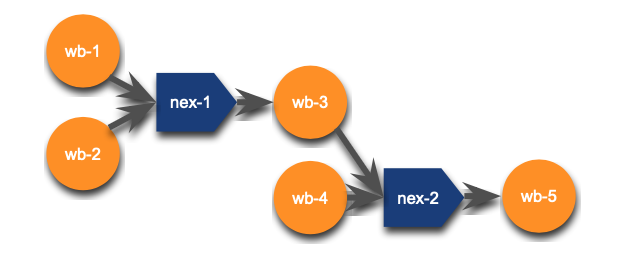

```{r setup, include=FALSE}
knitr::opts_chunk$set(echo = TRUE)
library(mapview)
library(sf)
library(dplyr)
```

## Hydrofabric

The hydrofabric is the foundation base data that allows NextGen to run 

  - It provides the landscape and flow network _discritizations_ 
  - It provides the _connectivity_ (topology) of the network features
  - It defines the locations _where information will be reported_ (nexus's)
  
```{r, echo = FALSE}
knitr::include_graphics('../man/figures/hydrofabric.png')
```

## Built on a Conceptual Data Model

- The hydrofabric features are grounded in the OGC [HY Feature conceptual model](https://docs.opengeospatial.org/is/14-111r6/14-111r6.html).

- The conceptual model laid out in HY Features is conflated with the [Simple Feature Access](https://www.ogc.org/standard/sfa/) Spatial Data model to provide a logical model for how the features are represneted in the hydrofabric data model.

## Build using cutting edge data science formats and access patterns
  
  - [GPKG](https://www.geopackage.org)
  - [GDAL VSI](https://www.google.com/url?sa=t&rct=j&q=&esrc=s&source=web&cd=&cad=rja&uact=8&ved=2ahUKEwil-fWKx_D-AhWCIzQIHXIHDD4QwqsBegQIAxAE&url=https%3A%2F%2Fwww.youtube.com%2Fwatch%3Fv%3DauK_gPR-e7M&usg=AOvVaw2ITVtXkwdDj5PCzIfSQwbW) and cloud resources
  - Arrow/[Parquet](https://parquet.apache.org/docs/overview/) Tables
  
And cloud provisioning 

  s3 (through AWS at the moment)

## Catchments are holistic features

https://docs.opengeospatial.org/is/14-111r6/14-111r6.html

```{r, echo = FALSE}
knitr::include_graphics('../man/figures/hyfeature.png')
```

> Can be made up of a one (1) flowpath and/or (2) divide representation:

 - 1) **internal** sinks and **coastal** catchments have a `divide`, but no `flowline`
 - 2) artificial paths (**connectors**) have a `flowline` but no `divide`
 - 3) members of a dendritic **network** have both a divide and `flowpath`
 
 **Note**: You can find this in the NextGen data model using the `has_flowline` and `has_divide` boolean feilds.
 
> When both a divide and flowpath representation exisit, there is a `1`:`1` relationship meaning there is one `flowpath` representation for each `divide`. In this case the numeric ID of each is the same, and both 

In the future, we will support the ability to have `1:many` `divide`:`*flowline*` representations

# How do we arrive at the NextGen Hydrofabric?

- NextGen is intended to be model agnostic.

- The hydrofabric is meant to be _Model Application Agnostic_. 

- This means that the hydrofabric should be able to support the modeling needs of applications like:
    1. NOAA NextGen (in its infinite flavors); 
    2. the USGS NHM; 
    3. the USGS SPPARROW model, 
    4. and eventually the NOAA FIM.

## The USGS-NOAA Reference Fabric

- For a single system to serve many - often distinct - modeling applicatins, there needs to be a set reference system. (analogous to a corrdinate refernece system (CRS)
- This reference system must provide the minumal (e.g. smallest discretization) of featrues "allowable" 
- Provide persisitent identification (PID) for durable data integration.

This has been an collaborative exercise between the USGS Water Mission Area, the NOAA Office of Water Prediction, and Lynker.

```{r, echo = FALSE}
knitr::include_graphics('../man/figures/logos.png')
```

More on this has been documented [here](https://waterdata.usgs.gov/blog/hydrofabric/)

### The 4 pillars of the Reference Fabric

https://www.sciencebase.gov/catalog/item/60be0e53d34e86b93891012b

```{r, echo = FALSE}
knitr::include_graphics('../man/figures/level1.png')
```
## 1. Reference Features
  - Simple, valid, representations of all `flowpath` and `divide` features
  - Must be derived from a *source* hydrographic dataset (e.g. NHDPLus, or)
  
  - Currently, these are built out from the NHDPlusV2 features
    - Waterbodies are simplified, islands are dissolved, and they are unioned on GNIS_ID.
    - Flowlines are ensured to be digitized from upsteam to downstream 
    - Catchments are simplifed, and DEM fragments are dissolved into the proper adjoing catchmetsn.
    
  - ADD Angus vingettes
  
  https://www.sciencebase.gov/catalog/item/6317a72cd34e36012efa4e8a

## 2. Reference Topology

  - Since its first release, the NHDPlus topology and value added attributes have been stable
  - Local groups and agencies have made modifications to this but these have never made it back into the primary source
  - Improvements made by the USGS, OWP, NCAR have been integrated to provide an updated network connectivity. 
  
  https://www.sciencebase.gov/catalog/item/63cb311ed34e06fef14f40a3
  
  
## 3. Reference POIs
  - Collected from a variety of of published data sources
  - Become `Hydrolocations` at the _outflow_ of the linked `flowpath`.
  - These locations have a _reference_ designating the source of the data, and a link designating the reference source ID.

# Processesing 

# Hydrofab Software
  - Integration of `hyRefactor`; `hyAgggregate`; `hyRelease` software
  - Provides the tools needed to manipulate and build hydrofabric from a reference 

## 1. Refactor

  Refactoring is a flowpath oriented workflow, that seeks to 
   1. Splitting large or long catchments to create a more uniform catchment size distribution,
   2. collapsing catchment topology to eliminate small catchments
   
   The fundemental key is that no network resolution is lost! That means the total path lenght of the network that goes in, is the same as the length of ht
   
```{r, echo = FALSE}
knitr::include_graphics('../man/figures/level2.png')
```

## 2. Aggregate
  Aggregation is a promarily divide oriented workflow
  Two aggregation methods:
    - To POIs
    - To distribution, with or w/o enforced POIs.
    
```{r, echo = FALSE}
knitr::include_graphics('../man/figures/level3.png')
```
    
## 3. Nextgen-ify!

  Nextgen operates on a `[flowpath --> nexus]` vs `[flowpath --> flowpath]` topology
  
```{r, echo = FALSE}
knitr::include_graphics('../man/figures/roadmap.png')
```
  
```{r, echo = FALSE}
knitr::include_graphics('../man/figures/topology.png')
```
  
```{r, echo = FALSE}

```

# PART 2: Hydrofabric Data and Data Model# 

https://docs.ogc.org/per/22-040.html


## Context ## 

For the following example, well look at the area upstream of the USGS Gage (06752260) monitoring the river network near Fort Collins, CO.

 - USGS Portal: https://waterdata.usgs.gov/monitoring-location/06752260
 - Geoconnex PID registry: https://reference.geoconnex.us/collections/gages/items?provider_id=06752260

[Mainstems Model](https://www.sciencedirect.com/science/article/pii/S1364815220309841)


```{r}
gage     <-  read_sf('https://reference.geoconnex.us/collections/gages/items?provider_id=06752260')
mainstem <-  read_sf(gage$mainstem_uri)

mapview(gage) + mainstem
```

https://reference.geoconnex.us/collections/mainstems/items/352913

## So what does a hydrofabric look like?

They are shared as geopackages. 

Geopackages are an OGC standard for share mulitple spatial and aspatial layers in a single file. 

At there core, GPKGs are SQLITE databases.

(Data Model)[https://noaa-owp.github.io/hydrofabric/articles/hf_dm.html]
```{r}
poudre = "../data/poudre.gpkg"
st_layers(poudre)
```

## Divides

```{r}
divides = read_sf(poudre, "divides")
```

```{r}
glimpse(divides[10,])
```

```{r}
mapview::mapview(divides[10,])
```

## Flowpaths

```{r}
flowpaths = read_sf(poudre, "flowpaths")

ms  = flowpaths %>% 
  slice_max(hydroseq) %>% 
  pull(mainstem)

xx = read_sf('https://reference.geoconnex.us/collections/mainstems/items/352913')

filter(flowpaths, mainstem == ms) %>% 
  mapview(color = 'red', lwd = 2) + xx
  
```

```{r}
gage     = read_sf('https://reference.geoconnex.us/collections/gages/items?provider_id=06752260')
mainstem = read_sf(gage$mainstem_uri)
flowpaths = read_sf(poudre, "flowpaths") %>% 
  filter(mainstem == basename(gage$mainstem_uri))

mapview(gage) + mainstem + mapview(flowpaths, color = "red")
```

```{r}
glimpse(flowpaths[10,])
```

```{r}
mapview::mapview(flowpaths[10,]) + 
  filter(divides, divide_id == flowpaths$divide_id[10])
```


## Nexus

```{r}
nexus = read_sf(poudre, "nexus")
```

```{r}
ms  = flowpaths %>% 
  slice_max(hydroseq) 
glimpse(nexus[10,])
```

```{r}

filter(nexus, id == 'nex-278699') %>% 
  glimpse()

mapview::mapview(flowpaths[10,]) + 
  filter(divides, divide_id == flowpaths$divide_id[10])
```