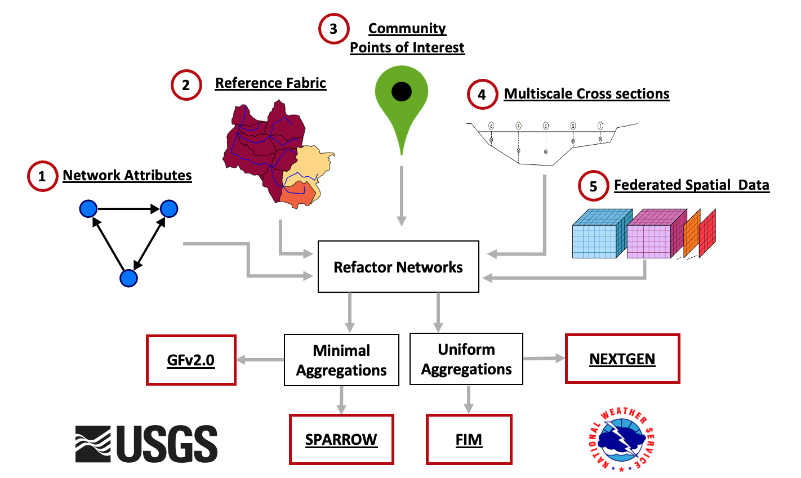

```{r setup, include=FALSE}
library(knitr)
knitr::opts_chunk$set(echo = TRUE, 
                      message = FALSE, 
                      warning = FALSE,
                      tidy=TRUE, tidy.opts=list(width.cutoff=60))
```

The hydrofabric team is focused on delivering a consistent, interoperable, flexible, cloud native solution for [hydrofabric data](https://noaa-owp.github.io/hydrofabric/articles/01-intro-deep-dive.html) to those interested in hydrologic modeling and geospatial analysis. We aim to provide _open data to improve open science_ and it doing so strive to make _real data [FAIR](https://www.go-fair.org/fair-principles/) data_.

In the contexts of DevCon, the hydrofabric provides the foundational features, topology and attributes needed for cartography, web mapping, geospatial analysis, machine learning, model evaluation, data assimilation, and NextGen (and AWI data stream, NGIAB, etc) applications. Outside of DevCon, it provides the needed infrastructure to support other mutli-scale modeling needs (e.g. NHM, US Water Census, Water Balance), vulnerability assessments, and more!


# Background 

Last year, we shared the concept of a [hydrofabric](https://noaa-owp.github.io/hydrofabric/articles/01-intro-deep-dive.html) and the current of NextGen data structures. A hydrofabric describes the landscape and flow network discretizations, the essential connectivity of network features, and the key reporting locations known as nexus points. Combined these feature serve as both geospatail and computational elements that allow the NextGen modeling infrastructure to syncronious different models, formulations, and domains into a cohert simulation and set of outputs.

## Key Highlights

1. **Design Philosophy**: We adopt the OGC [HY Feature conceptual model](https://docs.opengeospatial.org/is/14-111r6/14-111r6.html) with custom modifications for NextGen applications that define an explicit [data model](https://noaa-owp.github.io/hydrofabric/articles/hf_dm.html). This fundamental data model and evolving mode of delevery tailored for modeling and web infrastructure applications, emphasizing efficiency and accuracy through use of modern geospatial and data science formats. This included seven spatial and two a-spatial layers, and future plans for an additional layer for water bodies and cross sections. The NOAA enterprise hydrofabric is made up of 5 modular components, all of which will be touched on today. These include those seen below:

```{r roadmap, fig.align='center', echo = FALSE, fig.cap="Enterprise Hydrofabric System"}

```

2. **NHGF**: A core, federally consistent data product grounded in a common topology, reference fabric, and set of community POIs. Collectively, these define a shared NOAA/USGS National Hydrologic Geospatial Fabric (NHGF).

3. **Network Manipulation**: In-depth exploration of two [network manipulation](https://noaa-owp.github.io/hydrofabric/articles/03-processing-deep-dive.html) processes, refactoring and aggregating, that are crucial for optimizing data usage.

4. **Egress Free Community Hydrofabric** Data: Through Lynker-Spatial we provide efficient, free access to hydrofabric and hydrofabric-adjacent data. Over the last year, this system has had ~78,500 requests over 2,306 unique IPs with a month over month trend nearing exponential.

5. **Data Subsetting**: We demonstrated methods to [extract data subsets](https://noaa-owp.github.io/hydrofabric/articles/05-subsetting.html) for multi-scale modeling tasks using R and a [Go-based CLI](https://github.com/lynker-spatial/hfsubsetCLI). Since then, the R version and underlying data stores have been overhauled, the CLI implementation has transitioned to a (beta) [REST API](https://www.lynker-spatial.com/hydrofabric/hfsubset/__docs__/), and a Python implementation is forthcoming.

5. **Enriching a hydrofabric**: While the core hydrofabric respects the above data model we demontrated hoe it could be enhance through te addtioon of catchment attributes (both precomputed and custom), flowpath attributes, and forcing weights. Since then, through a partnership with ESIP we extended the climateR catalog to host access endpoints to over 100,000 unique data resources, developed a e machine learning models for estimating river bathymety and roughness, tools to extract high resolution  bathymetry informed ross sections, and applid these across CONUS - all of which are provided in the egress free cloud resources!


## Software

While the primary output of this system is a constantly evolving FAIR, cloud native, data products complete with services, these are all predicated on a suite of research (`hydrofab`) to publication ready (`nhdplusTools`, `climateR`) software. This suite of software is bundled together in `NOAA-OWP/hydrofabric` provides a collection of R packages designed for hydroscience data development and access. These packages share an underlying design philosophy, grammar, and data structures, making them easier to apply together. The packages cover a wide range of data manipulation tasks, from importing and cleaning data, to building custom hydrofabrics, to accessing and summarizing data from 100,000's of data resources. Assuming you are already [up and running with R, RStudio, and hydrofabric](https://noaa-owp.github.io/hydrofabric/articles/devcon2024-setup.html), you can attach the library to a working session: 

```{r}
library(hydrofabric)
```

`library(hydrofabric)` will load the core packages (alphabetical): 

* [climateR](https://github.com/mikejohnson51/climateR) for accessing federated data stores for parameter and attributes estimation
* [hfsubsetR](https://github.com/lynker-spatial/) for cloud-based hydrofabric subsetting
* [hydrofab](https://github.com/mikejohnson51/hydrofab) a tool set for "fabricating" multiscale hydrofabrics
* [ngen.hydrofab](https://github.com/mikejohnson51/ngen.hydrofab) NextGen extensions for hydrofab
* [nhdplusTools](https://github.com/doi-usgs/nhdplusTools/) for network manipulation
* [zonal](https://github.com/mikejohnson51/zonal) for catchment parameter estimation

Additionally it will load key geospatial data science libraries: 

* `dplyr` (data.frames)
* `sf` (vector)
* `terra` (raster)

### Benefits of Using `hydrofabric`

* **Consistency**: Packages are designed to work seamlessly together - with the Lynker-Spatial data stores - making workflows more efficient.
* **Readability**: Syntax is designed to be human-readable and expressive, which helps in writing clean and understandable code.
* **Efficiency**:  Functions are optimized for performance, making data manipulation tasks faster.

## Lynker-Spatial Data

Hydrofabric artifacts are generated from a set of [federally consistent reference datasets](https://noaa-owp.github.io/hydrofabric/articles/01-intro-deep-dive.html) built in collaboration between NOAA, the USGS, and Lynker for federal water modeling efforts. These artifacts are designed to be easily updated, manipulated, and quality controlled to meet the needs of a wide range of modeling tasks while leveraging the best possible input data.

Cloud-native (modified both in structure and format) artifacts of the [refactored and aggregated](https://noaa-owp.github.io/hydrofabric/articles/03-processing-deep-dive.html), [NextGen ready](https://noaa-owp.github.io/hydrofabric/articles/04-applying-nextgen-model.html) resources are publicly available through [lynker-spatial](https://www.lynker-spatial.com/) under an [ODbL](https://opendatacommons.org/licenses/odbl/summary/) license. If you use data, please ensure you (1) Attribute Lynker-Spatial, (2) keep the data open, and that (3) any works produced from this data offer that adapted database under the ODbL. 

Hydrofabric data on [lynker-spatial](https://www.lynker-spatial.com/data?path=hydrofabric%2F) follows the general s3 URI pattern for access: 

```{r pathing, eval = FALSE}
"{source}/{version}/{type}/{domain}_{layer}"
```

Where:

* `source` is the local or s3 location
* `version` is the release number (e.g. v2.2)
* `type` is the type of fabric (e.g. reference, nextgen, etc)
* `domain` is the region of interest (e.g. conus, hawaii, alaska)
* `layer` is the layer of the hydrofabric (e.g. divides, flowlines, network, attributes, etc.)

# High level Technical Overview

Below we provide more context on the data formats and technology we rely on toe help make our data FAIR, easy to use, and 

## Data Storage 

We use [s3 (via aws)](https://docs.aws.amazon.com/AmazonS3/latest/userguide/Welcome.html) for storage that is easy to sync locally, and access remotely. The design of our data structure makes versioning easier to track, and offer parity between local and remote access:

```{r sources}
version <-  'v2.2'
type <- "reference"
domain <- "conus"

local_source <- "/Users/mjohnson/hydrofabric"
s3_source    <- "s3://lynker-spatial/hydrofabric"

# Sync s3 with your local archive
(glue("aws s3 sync {s3_source}/{version}/{type} {local_source}/{version}/{type}"))
```

## Data Formats


### GPKG

[Geopackages](https://www.geopackage.org)/[SQLITE](https://sqlite.org/index.html) is an open, standards-based, platform-independent, and data format for spatial . It is designed to be a universal format for geospatial data storage, enabling the sharing and exchange of spatial data across different systems and software.

```{r gpkg}
gpkg <- "tutorial/poudre.gpkg"

# See Layers
st_layers(gpkg)

# Read Complete Layer
(divides = read_sf(gpkg, "divides"))
```
  
### Arrow/Parquet

Apache [Arrow](https://arrow.apache.org) is an open-source project that provides a columnar **memory** format for flat and hierarchical data. It proviees fast data transfer and processing across different programming languages and platforms without needing to serialize and deserialize the data, making it particularly useful for big data and high-performance applications.

[(geo)parquet](https://parquet.apache.org/docs/overview/) is an **on disc** data format for storing columar data. GeoParquet is an emerging standard for storing geospatial data within the Apache Parquet file format. Parquet is a columnar storage file format that is highly efficient for both storage and retrieval, particularly suited for big data and analytics applications.

We distribute hydrofabric layers as VPU-based hive partitioned (geo)parquet stores. These can be accessed from lynker-spatial, or, synced (see above) to a local directory. Hive partitioning is a partitioning strategy that is used to split a table into multiple files based on partition keys. The files are organized into folders.  

> The complete `v2.2/reference/` directory is ~3.0GB while the `v2.1.1/nextgen` dirctory is ~ 9.0GB (including xs, flowpath/model attributes, forcing weights and routelink)

  
#### Parquet store

```{r}
(x <- glue("{local_source}/{version}/{type}/{domain}_network"))
(x2 <- open_dataset(x))

glimpse(x2)

#> Remote parity
#> open_dataset(glue('{s3_source}/{version}/{type}/{domain}_network/'))
```

####  Geoparquet store

```{r}
(x <- glue("{local_source}/{version}/{type}/{domain}_divides"))
open_dataset(x)

#> Renote parity
#>  arrow::open_dataset(glue::glue("{s3_source}/{version}/{type}/conus_divides"))
```

### Parquet Schema

The [pqrs](https://github.com/manojkarthick/pqrs) library offers a command line tool of inspecting Parquet files

```{bash, eval = FALSE}
pqrs schema /Users/mjohnson/hydrofabric/v2.2/reference/conus_flowlines/vpuid=01/part-0.parquet
```

```{r, echo = FALSE}
knitr::include_graphics('../man/figures/pqrs_nice_formating.png')
```

### Virtual Access to Gridded Data (Primary COG, NetCDF, Zarr)

The amount of gridded data needed for the suite of our supported applications (let alone)
  - [GDAL VSI](https://www.google.com/url?sa=t&rct=j&q=&esrc=s&source=web&cd=&cad=rja&uact=8&ved=2ahUKEwil-fWKx_D-AhWCIzQIHXIHDD4QwqsBegQIAxAE&url=https%3A%2F%2Fwww.youtube.com%2Fwatch%3Fv%3DauK_gPR-e7M&usg=AOvVaw2ITVtXkwdDj5PCzIfSQwbW) 
  
```{r}
'/vsis3/lynker-spatial/gridded-resources/medium_range.forcing.tif' |> 
  dap(AOI = divides) |>
  plot()
```
 
## Lazy Evaluation

All datasets are distributed at the `domain` level (e.g. conus, hawaii, alaska). [Lazy evaluation](https://arrow.apache.org/cookbook/r/manipulating-data---tables.html) can help you get just the data you need, in memory from local or remote locations.
  
### Local GPKG

```{r}
as_sqlite(gpkg,  "divides") %>% 
  filter(divide_id == 2896607)

as_sqlite(gpkg,  "divides") %>% 
  filter(divide_id == 2896607) %>% 
  read_sf_dataset_sqlite()
```
  
### Local/Remote Parquet Store

```{r}
open_dataset(glue('{local_source}/{version}/{type}/conus_network/')) %>% 
  filter(id == 101) %>% 
  select(id, toid) %>% 
  collect()

#> arrow::open_dataset(glue::glue('{s3_source}/{version}/{type}/conus_network/')) %>% 
#>   dplyr::filter(id == 101) %>% 
#>   dplyr::select(id, toid) %>% 
#>   dplyr::collect()
```

# Extracting a VPU

Last year we highlighted a system that was built largely around VPU level gpkgs. While we no longer distribute these files, there is a utility function `hfsubsetR::get_vpu_fabric` that will extract a VPU level GPKG to a outfile of choice. 

```{r}
get_vpu_fabric("01", 
               type = "reference", 
               hf_version = "2.2", 
               outfile = "/Users/mjohnson/Downloads/01_ref_2.2.gpkg")
```

# oCONUS domains

We are slowly building up our oCONIS (Ontario, HI, PRVI, AK) domains. As they become avaialble, the same logic above will apply. For example to get Hawaii divides: 

```{r}
open_dataset(glue('{local_source}/{version}/{type}/hawaii_flowlines')) %>% 
  read_sf_dataset() %>% 
  mapview::mapview()
```
