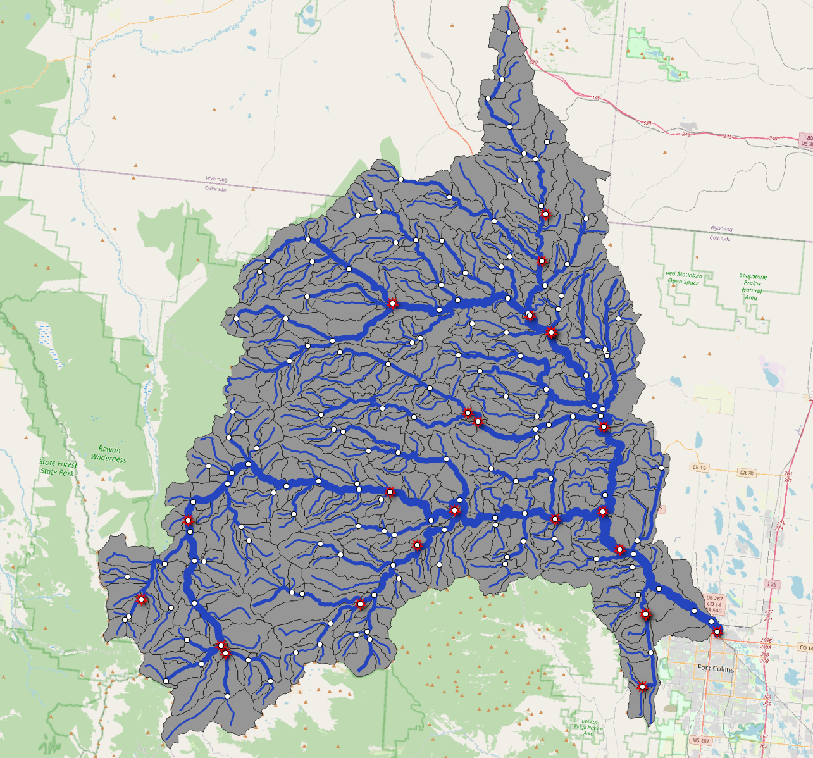

```{r setup, include=FALSE}
knitr::opts_chunk$set(echo = TRUE, out.width = "100%", message = TRUE)
```

Last year, we unveiled the concept of a [hydrofabric](https://noaa-owp.github.io/hydrofabric/articles/01-intro-deep-dive.html), representing the foundation of NextGen data structures. This data product describes the landscape and flow network discretizations, the essential connectivity of network features, and the key reporting locations known as nexus points.

## Key Highlights

1. **Design Philosophy**: Adaptation of the OGC [HY Feature conceptual model](https://docs.opengeospatial.org/is/14-111r6/14-111r6.html) with custom modifications for NextGen applications that define an explict data model.
2. **NHGF**: A core, federally consistent data product grounded in a common topology, reference fabric, and set of community POIs
2. **Network Manipulation**: In-depth exploration of two [network manipulation](https://noaa-owp.github.io/hydrofabric/articles/03-processing-deep-dive.html) processes, refactoring and aggregating, that are crucial for optimizing data usage.
3. **Data Model**: A fundamental data model tailored for modeling and web infrastructure applications, emphasizing efficiency and accuracy through use of modern geospatial (gpkg) and data science (arrow/parquet) formats.This included seven spatial and two a-spatial layers, and future plans for an additional layer for water bodies and cross sections
4. **Data Subsetting**: Demonstrations on how to [extract data subsets](https://noaa-owp.github.io/hydrofabric/articles/05-subsetting.html) to meet multi-scale modleing tasks. for multi-scale modeling tasks using R and a Go-based CLI.
5. **Landscape Characteristics**: Optional guidance on accessing and utilizing landscape characteristics to enhance the modeling process.

```{r, echo = FALSE}

```

In conclusion, the development of the NextGen Hydrofabric represents a collaborative venture between the USGS Water Mission Area, the NOAA Office of Water Prediction, and Lynker. This innovative system addresses the crucial need for a single reference system to serve diverse modeling applications. Analogous to a coordinate reference system (CRS), the reference fabric provides maximum feature set compatibility across interconnected models. Furthermore, it facilitates persistent identification (PID) for durable data integration and model interoperability, essential for effective decision-making in hydrological modeling and prediction.

# Welcome to Lynker spatial: Your Hub for Hydrographic Data and Hydroinformatics  
Through [Lynker spatial](https://staging.lynker-spatial.com/), we are proud to offer a comprehensive platform that hosts a wealth of scientific developments and data, particularly focusing on hydrographic data. 

## Federally Consistent Reference Product
In collaboration with esteemed partners at Lynker, NOAA, and the USGS, we are not merely introducing a new suite of federal hydroinformatics products; we are spearheading a paradigm shift in how we perceive, represent, and manage water resources at a national level. Our Federally Consistent Reference Product sets a new standard for accuracy, reliability, and comprehensiveness in hydrographic data, empowering scientists, policymakers, and stakeholders alike to make informed decisions regarding water resource management.

## Easily Accessible
Gone are the days of navigating through cumbersome geodatabases. At Lynker Spatial, we champion open geospatial data practices, ensuring that our products are easily accessible in a variety of formats. Whether you're conducting web mapping, spatial analysis, or delving into data science, our platform offers products that cater to your specific needs. With just a few clicks, you can access the wealth of hydrographic data and seamlessly integrate it into your projects and research endeavors.

## Intuitively Subsettable
Understanding the intricate dynamics of water resources requires the ability to focus on specific areas of interest. Our platform allows for intuitive subsetting of upstream drainage areas using various parameters such as location, known identifiers, and critical resources. This capability enables users to extract relevant data subsets tailored to their research objectives, facilitating deeper insights and more targeted analyses.

With Lynker Spatial, we invite you to explore a world of hydrographic data and hydroinformatics innovations, empowering you to make meaningful contributions to water resource management and scientific research.


# Hfsubset 

# R, Rstudio, hydrofabric library

To utilize the developed hydrofabric, you'll need R, which can be installed on macOS, windows and Linux. Once installed, you can enhance your workflow by adding RStudio, a user-friendly interface for R projects. With these tools, you will be able to effectively analyze hydrofabric data for scientific research and decision-making in hydrological modeling and prediction.

## macOS
### Step 1: Installing R

```{shell}
# Download and install R for macOS
curl -o R-4.4.0-arm64.pkg https://cloud.r-project.org/bin/macosx/big-sur-arm64/base/R-4.4.0-arm64.pkg
open R-4.4.0-arm64.pkg
```

### Step 2: Installing RStudio

```{shell}
# Download and install RStudio
curl -o RStudio.dmg https://download1.rstudio.org/electron/macos/RStudio-2024.04.1-748.dmg
open RStudio.dmg
```

## Ubuntu/Debian
### Step 1: Installing R

```{shell}
# Download and install R for Ubuntu
# update indices
sudo apt update -qq
# install two helper packages we need
sudo apt install --no-install-recommends software-properties-common dirmngr
# add the signing key (by Michael Rutter) for these repos
# To verify key, run gpg --show-keys /etc/apt/trusted.gpg.d/cran_ubuntu_key.asc 
# Fingerprint: E298A3A825C0D65DFD57CBB651716619E084DAB9
wget -qO- https://cloud.r-project.org/bin/linux/ubuntu/marutter_pubkey.asc | sudo tee -a /etc/apt/trusted.gpg.d/cran_ubuntu_key.asc
# add the R 4.0 repo from CRAN -- adjust 'focal' to 'groovy' or 'bionic' as needed
sudo add-apt-repository "deb https://cloud.r-project.org/bin/linux/ubuntu $(lsb_release -cs)-cran40/"
```

### Step 2: Installing RStudio

```{shell}
# Download and install RStudio
curl -o RStudio.dmg https://download1.rstudio.org/electron/jammy/amd64/rstudio-2024.04.1-748-amd64.deb
open RStudio.dmg
```


## Windows
In order to get the most out of this ecosystem, it is recommended that you use R through it's Integrated Development Environment (IDE) called RStudio.  While you can use R without this, the synergies between the two make using it a joy and not a pain.  Just make a mental note that, just like Python, R is the language, and the tool you use to run that (Notebooks, VSCode, or RStudio) are tools that make interactions and development tasks far more seamless than the single line console access.

To install this, simply navigate to the [RStudio desktop website](https://posit.co/download/rstudio-desktop/), and 
1. click the "DOWNLOAD AND INSTALL R" button, and then follow the prompts on screen
2. Click the "DOWNLOAD RSTUDIO DESKTOP FOR WINDOWS" button and follow the prompts on screen.

```{r, echo = FALSE}
knitr::include_graphics('../man/figures/_a41c5a9b63199bf43b896e811729899f.png')
```

3. The first time you open RStudio, it will ask you where R is installed.  You can leave the default radio button selected and it will automatically connect to your installed version of R.

```{r, echo = FALSE}
knitr::include_graphics('../man/figures/_2c541fad5bf3e3333c3944601f252add.png')
```

# QGIS

QGIS is a free and open-source geographic information system (GIS) software that allows users to visualize, analyze, and manage spatial data. Here's how to install QGIS on Linux, macOS, and Windows.

## macOS

```bash
brew install qgis
```
 
## Ubuntu/Debian

```bash
sudo apt update
sudo apt install qgis
```

## Windows

Download the installer from the [QGIS download page](https://www.qgis.org/en/site/forusers/download.html).
Run the downloaded installer file (.exe).
Follow the on-screen instructions to complete the installation.