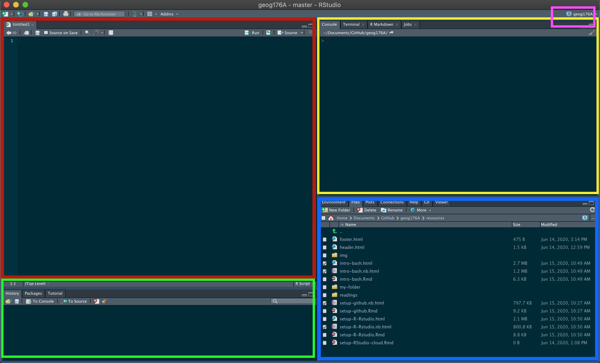
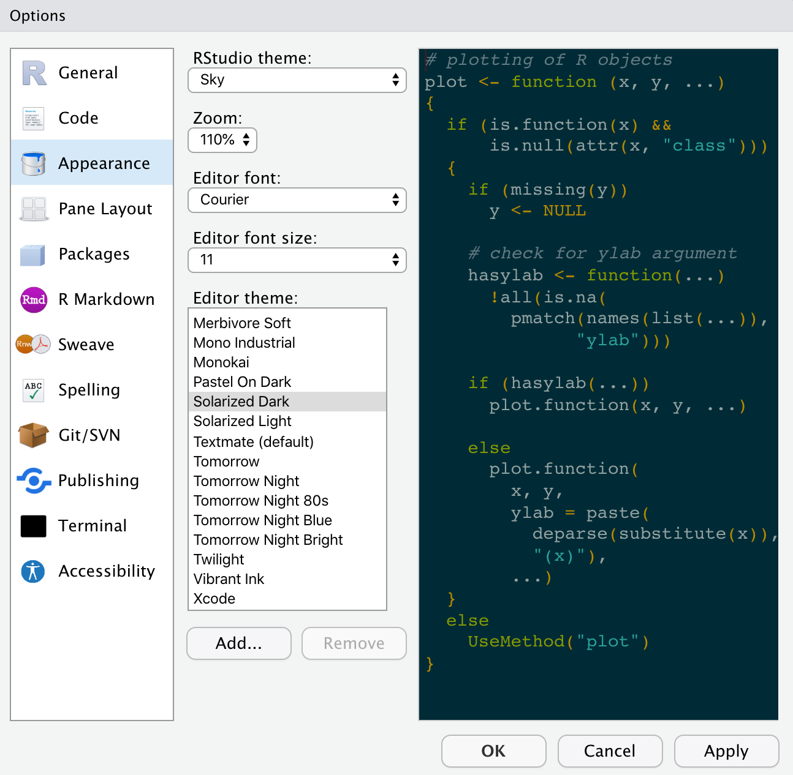
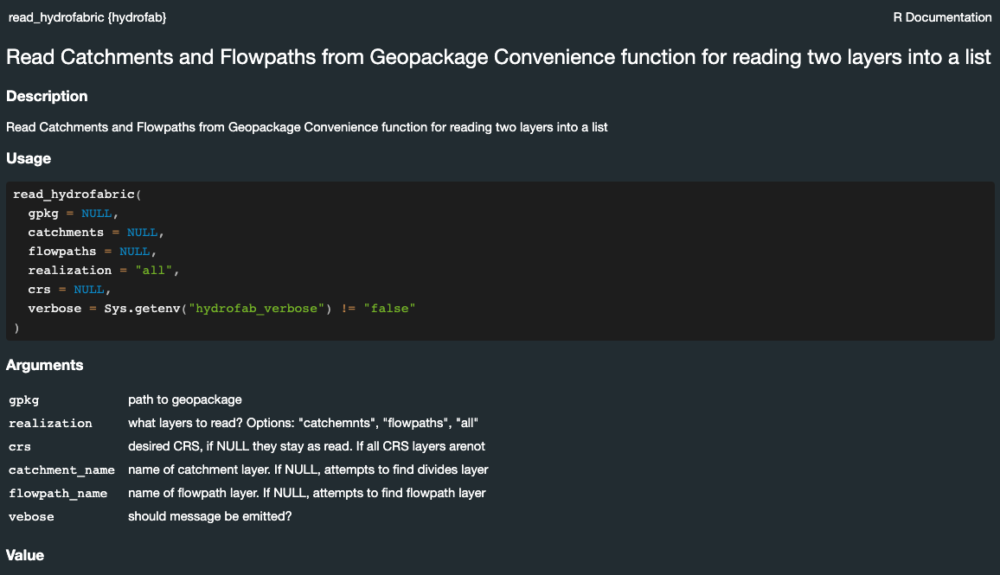

```{r setup, include=FALSE}
knitr::opts_chunk$set(echo = TRUE)
library(icons)
library(kableExtra)
```

```{r, echo = FALSE}

```

Welcome to **DevCon2024**! In the _Hydrofabric Workshop_ we will use R and RStudio. Ideally, you will be able to follow along on your own laptop and it is preferable to have the software on your system before the session.

The document will help get R & RStudio on your own computer, along with several other useful tools or packages. If you have problems, you can contact <a href = "mailto:jjohnson@lynker.com?subject=DevCon 2024 Install help"> Mike Johnson </a>

## Do you already have R installed?

If you have an older versions of R/RStudio installed, we recommend updating. You can check what version of R you are running by typing version in the console of RStudio.

```{r}
version$version.string
```

To check your RStudio version in Windows, click the About RStudio menu option in the Help menu. To check on a Mac, click the About RStudio menu option in the RStudio menu. 

If you don’t have at least R 4.4.XXX and RStudio 2023.6.0.XXXX. We suggest upgrading.

# 1. Getting R and RStudio

R is a programming language and free software environment for statistical computing and graphics supported by the R Foundation for Statistical Computing. The R language is widely used for developing statistical software and data analysis. R also provides unparalleled opportunities for analyzing spatial data for spatial modeling.

RStudio is an integrated development environment (IDE) for R.  Combined the R language and RStudio IDE provide the open-source, free, toolset for this course.

### MacOS Install `r fontawesome$brands$apple`

#### Install R

- [Download](https://cran.r-project.org/bin/macosx/) the latest release (“R-version.pkg”) of R and save the .pkg file. Double-click it to open, and follow the installation instructions. Note that there are different version in you have an Intel chip (e.g. R-4.1.0.pkg) or an Apple M1 chip (e.g. R-4.1.0-arm64.pkg)

- Now that R is installed, you can download and install RStudio.

#### Install RStudio

- [Download](https://rstudio.com/products/rstudio/download/#download) RStudio for Mac. After downloading, double-click the file to open it, and make sure it ends up in your applications folder.

***

### Windows Install `r fontawesome$brands$windows`

#### Install R

- [Download](https://cran.r-project.org/bin/windows/base/) the latest R installer (.exe) for Windows. Install the downloaded file as any other windows app. 

- Now that R is installed, you can download and install RStudio.

#### Install RStudio

- [Download](https://rstudio.com/products/rstudio/download/#download) the RStudio version for Windows. Run the installer (.exe file) and follow the instructions.

# 2. Launch RStudio

Once both R and RStudio are installed, you can find and click on the RStudio icon to open the program. The RStudio icon looks like this:

```{r, echo = FALSE, out.width="10%"}
knitr::include_graphics('../man/figures/rstudio-logo.png')
```

Opening RStudio will launch a workplace. If something like the below image appears for you, then you are all set! 

```{r, echo = FALSE}

```


We will spend the session working in this IDE so the layout and features will become clear as we go. A few things to note now are:

 - Your session is linked to a project (`r text_spec('pink', color = "pink")` box).  
 - In the `r text_spec('blue', color = "blue")` box, you have:
    - An *Environment* tab that shows all the active objects in your session
    - A *files* tab that shows all the files and folders in your default (project) workplace
    - A *plots* tab that will show all your graphs once we start visualizing data. 
  - In the `r text_spec('red', color = "red")` window you will write code and open new/existing scripts and markdown files.
  - All output will be printed to your console (`r text_spec('yellow', color = "gold")` box). Code and prompts can be directly entered in the console but will not be saved after executing. 
  
Your layout and theme may not look like the above (all the elements are the same but arranged differently). If you want to change your theme and layout got to RStudio --> Preferences.

Here you can adjust the "Appearance" and "Pane Layout". If you want your to look like mine, see below:


```{r, echo = FALSE}

```

# 3. Install `NOAA-OWP/hydrofabric`

R comes loaded with many base packages and tools. There are also many additional tools that will make your life easier. Throughout this session, we’ll use packages that exist in the aggregate `hydrofabric` package.

The `hydrofabric` contains a collection of very useful packages that play nicely together for data exploration, manipulation, wrangling and visualization (among other things). Packages can be installed from CRAN (Comprehensive R Archive Network) using the following pattern which should be typed in the console (`r text_spec('yellow', color = "gold")` box):

```{r, eval = FALSE}
install.packages('powerjoin')
install.packages("remotes") 
```

In development package (yay DevCon!) can be installed from Github using the `remotes` package (installed above):

```{r, eval = FALSE}
remotes::install_github("NOAA-OWP/hydrofabric")
```

Once it’s installed, you can ensure that everything worked by loading/attaching the `hydrofabric` libray using the `library` call:

```{r}
library(hydrofabric)
```

If you got something similar to the above you’ve successfully installed **R**, **RStudio**, and the **hydrofabric** package!


If you really want to make sure you are ready, ensure you get all `TRUE` below: 

```{r}
hydrofabric_packages() %in% rownames(installed.packages()) 
```

## Quick R Notes

```{r}
## NOTE: What is glue?
x <- "Welcome to DevCon"
y <- "2024"
z <- c('2023', '2024', '2025', '...')

# single string
glue("{x} {y}")

# multiple strings from vectors
glue("{x} {z}")
```

```{bash, eval = F}
?read_hydrofabric
```

```{r, echo = F}

```

# 4. Visit Lynker Spatial

[Lynker spatial](https://www.lynker-spatial.com/) provides open **data** and software **services** aimed at improving user experience with hydrofabric allowing for rapid access, subsetting, and integration with other cloud native resources.

* Lynker-spatial Data offerings for hydrofabric can be found [here](https://www.lynker-spatial.com/data?path=hydrofabric%2F)

* Lynker-spatial Services are typically provided on Github [here](https://github.com/lynker-spatial).

> It's suggested to install the latest version of `hfsubsetCLI` from the [release page](https://github.com/lynker-spatial/hfsubsetCLI/releases/) for your specific operation system.

# 5. (Optional) Review Technical Background

If you are interested in the technical tools we use, how they are structured, and their application please review the [Background](https://noaa-owp.github.io/hydrofabric/articles/devcon2024-background.html) document. While we will talk through this during the session, having a familiarity will help as we move (quickly) through them.

# 6. (Optional) Install QGIS

QGIS is a free and open-source geographic information system (GIS) software that allows users to visualize, analyze, and manage spatial data. You can install the binaries for your system directly from their [website](https://qgis.org/en/site/forusers/download.html). Or using the following package managers.

### MacOS

```bash
brew install qgis
```
 
### Ubuntu/Debian

```bash
sudo apt update
sudo apt install qgis
```


